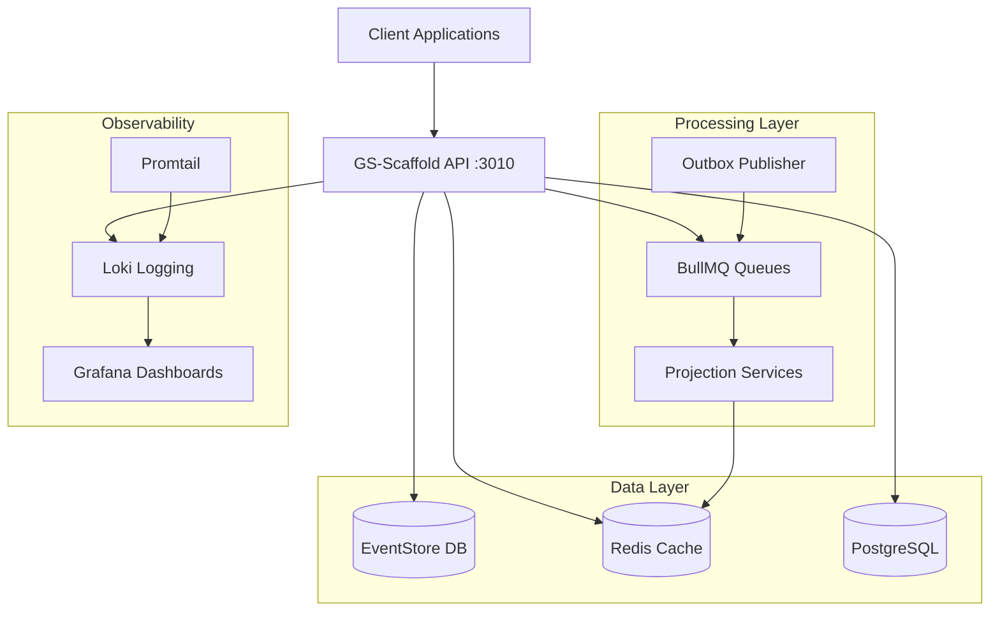
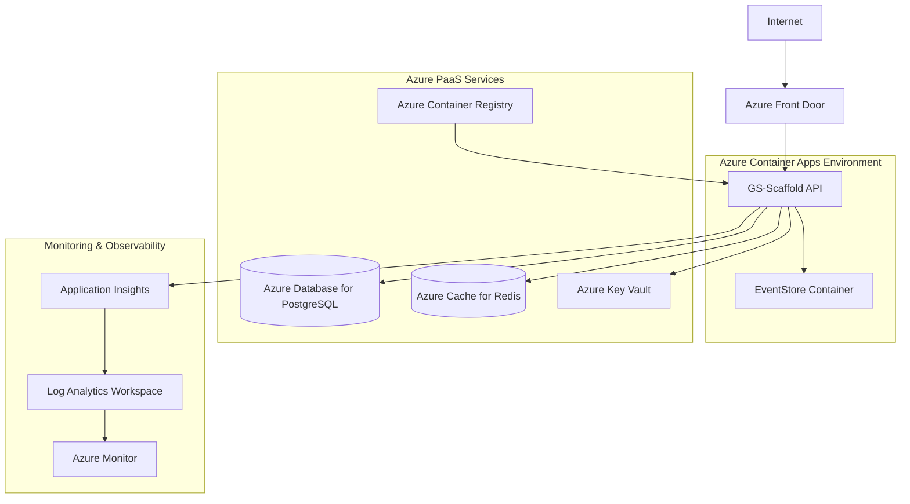

# Azure Deployment Guide for GS-Scaffold

## 📋 Executive Summary

This document provides a comprehensive deployment strategy for the **GS-Scaffold** NestJS application to Microsoft Azure. The application features a sophisticated three-tier architecture with EventStore, Redis, PostgreSQL, and advanced logging capabilities, all containerized and production-ready.

## 🏗️ Architecture Overview

### Current Application Architecture



### Target Azure Architecture



## 🎯 Deployment Phases

### Phase 1: Infrastructure Foundation

#### 1.1 Resource Group Creation

```bash
# Create main resource group
az group create \
  --name rg-gs-scaffold-prod \
  --location eastus \
  --tags \
    project=gs-scaffold \
    environment=production \
    owner=engineering
```

#### 1.2 Azure Container Registry

```bash
# Create container registry for application images
az acr create \
  --resource-group rg-gs-scaffold-prod \
  --name acrgsscaffoldprod \
  --sku Standard \
  --admin-enabled true \
  --tags \
    component=container-registry \
    tier=shared

# Login to registry
az acr login --name acrgsscaffoldprod
```

#### 1.3 Key Vault for Secrets Management

```bash
# Create Key Vault for secure configuration
az keyvault create \
  --name kv-gs-scaffold-prod \
  --resource-group rg-gs-scaffold-prod \
  --location eastus \
  --sku standard \
  --enable-soft-delete true \
  --retention-days 7 \
  --tags \
    component=secrets-management \
    tier=security
```

### Phase 2: Database Infrastructure

#### 2.1 Azure Database for PostgreSQL

```bash
# Create PostgreSQL Flexible Server
az postgres flexible-server create \
  --resource-group rg-gs-scaffold-prod \
  --name postgres-gs-scaffold-prod \
  --location eastus \
  --admin-user gsscaffold_admin \
  --admin-password '<SECURE_PASSWORD>' \
  --sku-name Standard_B2s \
  --tier Burstable \
  --storage-size 128 \
  --version 14 \
  --backup-retention 7 \
  --geo-redundant-backup Disabled \
  --high-availability Disabled \
  --public-access 0.0.0.0 \
  --tags \
    component=database \
    tier=data \
    engine=postgresql

# Create application database
az postgres flexible-server db create \
  --resource-group rg-gs-scaffold-prod \
  --server-name postgres-gs-scaffold-prod \
  --database-name gs_scaffold_read

# Configure firewall for Azure services
az postgres flexible-server firewall-rule create \
  --resource-group rg-gs-scaffold-prod \
  --name postgres-gs-scaffold-prod \
  --rule-name AllowAzureServices \
  --start-ip-address 0.0.0.0 \
  --end-ip-address 0.0.0.0
```

#### 2.2 Azure Cache for Redis

```bash
# Create Redis cache for projections and queues
az redis create \
  --resource-group rg-gs-scaffold-prod \
  --name redis-gs-scaffold-prod \
  --location eastus \
  --sku Standard \
  --vm-size c1 \
  --enable-non-ssl-port false \
  --minimum-tls-version 1.2 \
  --tags \
    component=cache \
    tier=data \
    engine=redis

# Configure Redis for multiple databases
az redis patch-schedule create \
  --resource-group rg-gs-scaffold-prod \
  --name redis-gs-scaffold-prod \
  --schedule-entries '[{"dayOfWeek":"Sunday","startHourUtc":2,"maintenanceWindow":"PT2H"}]'
```

### Phase 3: Container Apps Environment

#### 3.1 Create Container Apps Environment

```bash
# Install Container Apps extension
az extension add --name containerapp --upgrade

# Create Log Analytics Workspace
az monitor log-analytics workspace create \
  --resource-group rg-gs-scaffold-prod \
  --workspace-name law-gs-scaffold-prod \
  --location eastus \
  --tags \
    component=logging \
    tier=observability

# Get workspace ID and key
LAW_ID=$(az monitor log-analytics workspace show \
  --resource-group rg-gs-scaffold-prod \
  --workspace-name law-gs-scaffold-prod \
  --query customerId \
  --output tsv)

LAW_KEY=$(az monitor log-analytics workspace get-shared-keys \
  --resource-group rg-gs-scaffold-prod \
  --workspace-name law-gs-scaffold-prod \
  --query primarySharedKey \
  --output tsv)

# Create Container Apps Environment
az containerapp env create \
  --name cae-gs-scaffold-prod \
  --resource-group rg-gs-scaffold-prod \
  --location eastus \
  --logs-workspace-id $LAW_ID \
  --logs-workspace-key $LAW_KEY \
  --tags \
    component=container-environment \
    tier=compute
```

#### 3.2 Deploy EventStore Container

```bash
# Create EventStore container app
az containerapp create \
  --name ca-eventstore-prod \
  --resource-group rg-gs-scaffold-prod \
  --environment cae-gs-scaffold-prod \
  --image eventstore/eventstore:24.2.0-bookworm-slim \
  --target-port 2113 \
  --ingress internal \
  --min-replicas 1 \
  --max-replicas 1 \
  --cpu 1.0 \
  --memory 2.0Gi \
  --env-vars \
    EVENTSTORE_CLUSTER_SIZE=1 \
    EVENTSTORE_RUN_PROJECTIONS=All \
    EVENTSTORE_START_STANDARD_PROJECTIONS=true \
    EVENTSTORE_INSECURE=true \
    EVENTSTORE_ENABLE_ATOM_PUB_OVER_HTTP=true \
    EVENTSTORE_LOG_LEVEL=Information \
  --tags \
    component=eventstore \
    tier=data
```

### Phase 4: Application Deployment

#### 4.1 Build and Push Application Image

```bash
# Build production image
cd /path/to/gs-scaffold
docker build -f Dockerfile.prod -t acrgsscaffoldprod.azurecr.io/gs-scaffold:latest .

# Push to Azure Container Registry
docker push acrgsscaffoldprod.azurecr.io/gs-scaffold:latest

# Tag with version for rollback capability
docker tag acrgsscaffoldprod.azurecr.io/gs-scaffold:latest \
  acrgsscaffoldprod.azurecr.io/gs-scaffold:v1.0.0
docker push acrgsscaffoldprod.azurecr.io/gs-scaffold:v1.0.0
```

#### 4.2 Store Connection Strings in Key Vault

```bash
# Get connection strings
POSTGRES_CONNECTION=$(az postgres flexible-server show-connection-string \
  --server-name postgres-gs-scaffold-prod \
  --database-name gs_scaffold_read \
  --admin-user gsscaffold_admin \
  --admin-password '<SECURE_PASSWORD>' \
  --query connectionStrings.nodejs \
  --output tsv)

REDIS_CONNECTION=$(az redis list-keys \
  --resource-group rg-gs-scaffold-prod \
  --name redis-gs-scaffold-prod \
  --query primaryKey \
  --output tsv)

# Store in Key Vault
az keyvault secret set \
  --vault-name kv-gs-scaffold-prod \
  --name postgres-connection-string \
  --value "$POSTGRES_CONNECTION"

az keyvault secret set \
  --vault-name kv-gs-scaffold-prod \
  --name redis-connection-string \
  --value "rediss://redis-gs-scaffold-prod.redis.cache.windows.net:6380?password=$REDIS_CONNECTION&ssl=true"

az keyvault secret set \
  --vault-name kv-gs-scaffold-prod \
  --name eventstore-connection-string \
  --value "esdb://ca-eventstore-prod:2113?tls=false"
```

#### 4.3 Deploy Main Application

```bash
# Create Application Insights
az monitor app-insights component create \
  --app ai-gs-scaffold-prod \
  --location eastus \
  --resource-group rg-gs-scaffold-prod \
  --application-type web \
  --workspace law-gs-scaffold-prod \
  --tags \
    component=application-insights \
    tier=observability

# Get Application Insights connection string
AI_CONNECTION=$(az monitor app-insights component show \
  --app ai-gs-scaffold-prod \
  --resource-group rg-gs-scaffold-prod \
  --query connectionString \
  --output tsv)

# Store in Key Vault
az keyvault secret set \
  --vault-name kv-gs-scaffold-prod \
  --name application-insights-connection-string \
  --value "$AI_CONNECTION"

# Deploy main application container
az containerapp create \
  --name ca-gs-scaffold-api-prod \
  --resource-group rg-gs-scaffold-prod \
  --environment cae-gs-scaffold-prod \
  --image acrgsscaffoldprod.azurecr.io/gs-scaffold:latest \
  --target-port 3010 \
  --ingress external \
  --min-replicas 2 \
  --max-replicas 10 \
  --cpu 0.5 \
  --memory 1.0Gi \
  --registry-server acrgsscaffoldprod.azurecr.io \
  --system-assigned \
  --env-vars \
    NODE_ENV=production \
    LOG_LEVEL=info \
    LOG_SINK=stdout \
    PRETTY_LOGS=false \
    APP_NAME=gs-scaffold \
    APP_VERSION=1.0.0 \
    DB_SCHEMA=gs_scaffold_read \
    REDIS_PROJECTIONS_DB=1 \
    REDIS_KEY_PREFIX="prod:gs:" \
    DB_SLOW_QUERY_THRESHOLD=1000 \
  --secrets \
    postgres-connection=keyvaultref:https://kv-gs-scaffold-prod.vault.azure.net/secrets/postgres-connection-string,identityref:system \
    redis-connection=keyvaultref:https://kv-gs-scaffold-prod.vault.azure.net/secrets/redis-connection-string,identityref:system \
    eventstore-connection=keyvaultref:https://kv-gs-scaffold-prod.vault.azure.net/secrets/eventstore-connection-string,identityref:system \
    insights-connection=keyvaultref:https://kv-gs-scaffold-prod.vault.azure.net/secrets/application-insights-connection-string,identityref:system \
  --secret-env-vars \
    POSTGRES_URL=postgres-connection \
    DATABASE_URL=postgres-connection \
    REDIS_URL=redis-connection \
    EVENTSTORE_CONNECTION_STRING=eventstore-connection \
    EVENTSTORE_URL=eventstore-connection \
    APPLICATIONINSIGHTS_CONNECTION_STRING=insights-connection \
  --tags \
    component=api \
    tier=application
```

### Phase 5: Security & Access Control

#### 5.1 Configure Managed Identity Access

```bash
# Get the Container App's system-assigned identity
IDENTITY_ID=$(az containerapp identity show \
  --name ca-gs-scaffold-api-prod \
  --resource-group rg-gs-scaffold-prod \
  --query principalId \
  --output tsv)

# Grant Key Vault access to the Container App
az keyvault set-policy \
  --name kv-gs-scaffold-prod \
  --object-id $IDENTITY_ID \
  --secret-permissions get list

# Grant Container Registry access
az role assignment create \
  --assignee $IDENTITY_ID \
  --role AcrPull \
  --scope $(az acr show --name acrgsscaffoldprod --resource-group rg-gs-scaffold-prod --query id --output tsv)
```

#### 5.2 Network Security

```bash
# Create private endpoints (optional for enhanced security)
# This requires VNet integration

# Configure firewall rules for databases
az postgres flexible-server firewall-rule create \
  --resource-group rg-gs-scaffold-prod \
  --name postgres-gs-scaffold-prod \
  --rule-name AllowContainerApps \
  --start-ip-address <CONTAINER_APP_OUTBOUND_IP> \
  --end-ip-address <CONTAINER_APP_OUTBOUND_IP>
```

### Phase 6: Monitoring & Observability

#### 6.1 Configure Application Insights

```bash
# Enable Application Map and Live Metrics
az monitor app-insights component update \
  --app ai-gs-scaffold-prod \
  --resource-group rg-gs-scaffold-prod \
  --set properties.samplingPercentage=100

# Create custom dashboard
az portal dashboard create \
  --resource-group rg-gs-scaffold-prod \
  --name "GS-Scaffold Production Dashboard" \
  --input-path dashboard-config.json
```

#### 6.2 Set Up Alerts

```bash
# Create action group for notifications
az monitor action-group create \
  --resource-group rg-gs-scaffold-prod \
  --name ag-gs-scaffold-alerts \
  --short-name gs-alerts \
  --email-receivers name=ops email=ops@company.com

# High error rate alert
az monitor metrics alert create \
  --name "High Error Rate" \
  --resource-group rg-gs-scaffold-prod \
  --scopes $(az containerapp show --name ca-gs-scaffold-api-prod --resource-group rg-gs-scaffold-prod --query id --output tsv) \
  --condition "avg exceptions/server > 10" \
  --window-size 5m \
  --evaluation-frequency 1m \
  --action ag-gs-scaffold-alerts

# High CPU alert
az monitor metrics alert create \
  --name "High CPU Usage" \
  --resource-group rg-gs-scaffold-prod \
  --scopes $(az containerapp show --name ca-gs-scaffold-api-prod --resource-group rg-gs-scaffold-prod --query id --output tsv) \
  --condition "avg UsageNanoCores > 800000000" \
  --window-size 5m \
  --evaluation-frequency 1m \
  --action ag-gs-scaffold-alerts
```

## 🚀 Post-Deployment Configuration

### Database Migrations

```bash
# Run database migrations
az containerapp exec \
  --name ca-gs-scaffold-api-prod \
  --resource-group rg-gs-scaffold-prod \
  --command "npm run migration:run"
```

### Health Check Validation

```bash
# Get the application URL
APP_URL=$(az containerapp show \
  --name ca-gs-scaffold-api-prod \
  --resource-group rg-gs-scaffold-prod \
  --query properties.configuration.ingress.fqdn \
  --output tsv)

# Test health endpoint
curl -f "https://$APP_URL/health"

# Test API endpoint
curl -f "https://$APP_URL/api/health"
```

## 🔄 CI/CD Pipeline Configuration

### Azure DevOps Pipeline

```yaml
# azure-pipelines.yml
trigger:
  branches:
    include:
      - main
      - release/*

variables:
  containerRegistry: 'acrgsscaffoldprod.azurecr.io'
  imageRepository: 'gs-scaffold'
  dockerfilePath: 'Dockerfile.prod'
  tag: '$(Build.BuildId)'
  resourceGroup: 'rg-gs-scaffold-prod'
  containerAppName: 'ca-gs-scaffold-api-prod'

stages:
  - stage: Build
    displayName: Build and Push
    jobs:
      - job: Build
        displayName: Build
        pool:
          vmImage: ubuntu-latest
        steps:
          - task: Docker@2
            displayName: Build and push image
            inputs:
              command: buildAndPush
              repository: $(imageRepository)
              dockerfile: $(dockerfilePath)
              containerRegistry: $(containerRegistry)
              tags: |
                $(tag)
                latest

  - stage: Deploy
    displayName: Deploy to Azure
    dependsOn: Build
    condition: succeeded()
    jobs:
      - deployment: Deploy
        displayName: Deploy
        pool:
          vmImage: ubuntu-latest
        environment: production
        strategy:
          runOnce:
            deploy:
              steps:
                - task: AzureContainerApps@1
                  displayName: Deploy Container App
                  inputs:
                    azureSubscription: $(azureServiceConnection)
                    containerAppName: $(containerAppName)
                    resourceGroup: $(resourceGroup)
                    imageToDeploy: $(containerRegistry)/$(imageRepository):$(tag)
```

### GitHub Actions Workflow

```yaml
# .github/workflows/deploy.yml
name: Deploy to Azure Container Apps

on:
  push:
    branches: [main]
  pull_request:
    branches: [main]

env:
  REGISTRY: acrgsscaffoldprod.azurecr.io
  IMAGE_NAME: gs-scaffold
  RESOURCE_GROUP: rg-gs-scaffold-prod
  CONTAINER_APP: ca-gs-scaffold-api-prod

jobs:
  build-and-deploy:
    runs-on: ubuntu-latest
    steps:
      - uses: actions/checkout@v4

      - name: Login to Azure
        uses: azure/login@v1
        with:
          creds: ${{ secrets.AZURE_CREDENTIALS }}

      - name: Login to Container Registry
        run: az acr login --name ${{ env.REGISTRY }}

      - name: Build and push Docker image
        run: |
          docker build -f Dockerfile.prod -t ${{ env.REGISTRY }}/${{ env.IMAGE_NAME }}:${{ github.sha }} .
          docker push ${{ env.REGISTRY }}/${{ env.IMAGE_NAME }}:${{ github.sha }}

      - name: Deploy to Container Apps
        run: |
          az containerapp update \
            --name ${{ env.CONTAINER_APP }} \
            --resource-group ${{ env.RESOURCE_GROUP }} \
            --image ${{ env.REGISTRY }}/${{ env.IMAGE_NAME }}:${{ github.sha }}
```

## 📊 Cost Optimization

### Resource Sizing Recommendations

| Component            | SKU/Size                          | Monthly Cost (Est.) | Justification                       |
| -------------------- | --------------------------------- | ------------------- | ----------------------------------- |
| Container Apps       | 0.5 vCPU, 1GB RAM (2-10 replicas) | $50-250             | Auto-scaling based on load          |
| PostgreSQL           | Standard_B2s (2 vCPU, 4GB)        | $85                 | Right-sized for read models         |
| Redis Cache          | Standard C1 (1GB)                 | $75                 | Sufficient for projections + queues |
| Application Insights | Standard                          | $15-50              | Based on telemetry volume           |
| Container Registry   | Standard                          | $20                 | Image storage and bandwidth         |
| Key Vault            | Standard                          | $3                  | Secrets storage                     |
| **Total**            |                                   | **$248-483/month**  | Production-ready baseline           |

### Cost Optimization Strategies

1. **Auto-scaling Configuration**
   - Scale down to 1 replica during off-hours
   - Scale up based on CPU/memory thresholds
   - Use spot instances for development environments

2. **Database Optimization**
   - Use burstable instance types for variable workloads
   - Configure backup retention based on compliance needs
   - Consider read replicas only if needed

3. **Storage Optimization**
   - Enable log retention policies
   - Use lifecycle management for container images
   - Compress and optimize Docker image layers

## 🔍 Troubleshooting Guide

### Common Issues

#### 1. Container App Won't Start

```bash
# Check logs
az containerapp logs show \
  --name ca-gs-scaffold-api-prod \
  --resource-group rg-gs-scaffold-prod \
  --follow

# Check revision status
az containerapp revision list \
  --name ca-gs-scaffold-api-prod \
  --resource-group rg-gs-scaffold-prod \
  --output table
```

#### 2. Database Connection Issues

```bash
# Test PostgreSQL connectivity
az postgres flexible-server connect \
  --name postgres-gs-scaffold-prod \
  --admin-user gsscaffold_admin \
  --admin-password '<PASSWORD>' \
  --database-name gs_scaffold_read

# Check firewall rules
az postgres flexible-server firewall-rule list \
  --resource-group rg-gs-scaffold-prod \
  --name postgres-gs-scaffold-prod
```

#### 3. Redis Connection Issues

```bash
# Test Redis connectivity
az redis export \
  --resource-group rg-gs-scaffold-prod \
  --name redis-gs-scaffold-prod \
  --prefix test \
  --file-format RDB

# Check Redis metrics
az monitor metrics list \
  --resource $(az redis show --name redis-gs-scaffold-prod --resource-group rg-gs-scaffold-prod --query id --output tsv) \
  --metric "connectedclients,usedmemory" \
  --start-time 2024-01-01T00:00:00Z
```

### Performance Monitoring

#### Key Metrics to Monitor

1. **Application Performance**
   - Response time (target: <500ms)
   - Error rate (target: <1%)
   - Request throughput
   - Memory usage (target: <80%)
   - CPU usage (target: <70%)

2. **Database Performance**
   - Connection count
   - Query execution time
   - Slow query identification
   - Storage utilization

3. **Infrastructure Health**
   - Container restart frequency
   - Network latency
   - Storage I/O performance
   - Cache hit ratio

## 🔐 Security Considerations

### Production Security Checklist

- ✅ **Secrets Management**: All sensitive data in Key Vault
- ✅ **Network Security**: Internal ingress for EventStore
- ✅ **Identity & Access**: Managed identities for service authentication
- ✅ **Data Encryption**: TLS in transit, encryption at rest
- ✅ **Monitoring**: Comprehensive logging and alerting
- ✅ **Compliance**: Audit trails and access logging
- ⚠️ **Network Isolation**: Consider VNet integration for enhanced security
- ⚠️ **Private Endpoints**: Evaluate for database connections
- ⚠️ **WAF**: Consider Azure Front Door with WAF for public endpoints

### Security Hardening Steps

1. **Enable Azure Security Center**
2. **Configure Azure Defender for containers**
3. **Implement network security groups**
4. **Enable diagnostic logging for all resources**
5. **Regular security assessment and penetration testing**

## 📚 Additional Resources

### Documentation Links

- [Azure Container Apps Documentation](https://docs.microsoft.com/en-us/azure/container-apps/)
- [Azure Database for PostgreSQL](https://docs.microsoft.com/en-us/azure/postgresql/)
- [Azure Cache for Redis](https://docs.microsoft.com/en-us/azure/azure-cache-for-redis/)
- [Application Insights](https://docs.microsoft.com/en-us/azure/azure-monitor/app/app-insights-overview)

### Support Contacts

- **Infrastructure Team**: infrastructure@company.com
- **DevOps Team**: devops@company.com
- **Security Team**: security@company.com

---

_Document Version: 1.0_  
_Last Updated: August 14, 2025_  
_Author: Engineering Team_
