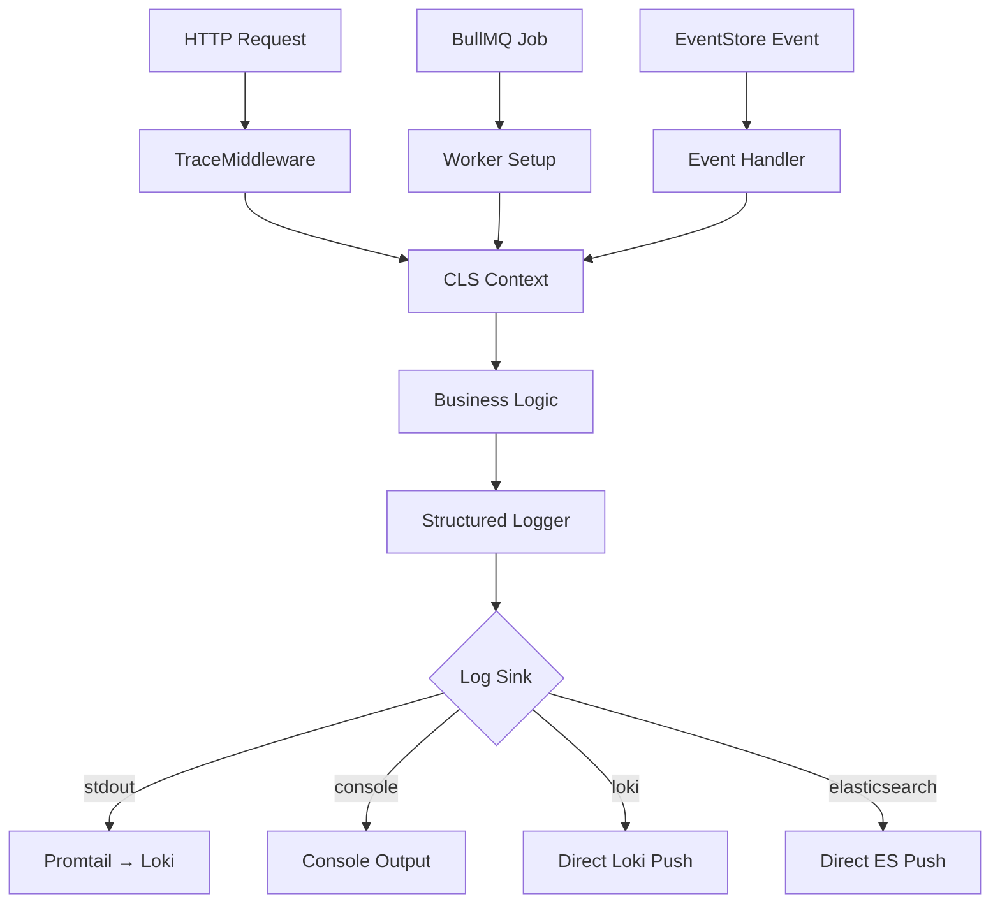

# GS-Scaffold Centralized Logging Implementation Guide

> **A complete guide to implementing, configuring, and using the centralized logging strategy in NestJS applications.**

## Table of Contents

1. [Quick Start](#quick-start)
2. [Architecture Overview](#architecture-overview)
3. [Configuration](#configuration)
4. [Usage Examples](#usage-examples)
5. [Integration Patterns](#integration-patterns)
6. [Troubleshooting](#troubleshooting)
7. [Best Practices](#best-practices)
8. [Monitoring & Observability](#monitoring--observability)

---

## Quick Start

### 1. Installation & Setup

**Prerequisites:**

- Node.js 18+
- NestJS 10+
- Docker & Docker Compose (for local development)

**Install Dependencies:**

```bash
npm install nestjs-pino nestjs-cls pino-loki pino-elasticsearch pino-pretty bullmq
```

**Start Logging Stack:**

```bash
# Copy environment configuration
cp .env.example .env

# Start Loki, Grafana, and Promtail
docker-compose up -d

# Access Grafana: http://localhost:3000 (admin/secret)
# Access Loki: http://localhost:3100
```

### 2. Basic Integration

**Import LoggingModule in your AppModule:**

```typescript
import { Module, NestModule, MiddlewareConsumer } from '@nestjs/common';
import { ClsModule } from 'nestjs-cls';
import { LoggingModule } from './shared/logging/logging.module';
import { TraceMiddleware } from './shared/logging/trace.middleware';

@Module({
  imports: [
    ClsModule.forRoot({
      global: true,
      middleware: { mount: true },
    }),
    LoggingModule, // Your custom logging module
  ],
  // ... other modules
})
export class AppModule implements NestModule {
  configure(consumer: MiddlewareConsumer) {
    consumer.apply(TraceMiddleware).forRoutes('*');
  }
}
```

**Use in Services:**

```typescript
import { Injectable, Inject } from '@nestjs/common';
import type { Logger } from 'pino';
import { Log } from './shared/logging/structured-logger';

@Injectable()
export class MyService {
  constructor(@Inject('APP_LOGGER') private readonly logger: Logger) {}

  async processData(id: string) {
    Log.info(this.logger, 'Processing started', {
      service: 'data-processor',
      component: 'MyService',
      method: 'processData',
      dataId: id,
    });

    try {
      // Your business logic here
      const result = await this.someOperation(id);

      Log.info(this.logger, 'Processing completed', {
        service: 'data-processor',
        component: 'MyService',
        method: 'processData',
        dataId: id,
        timingMs: 150,
      });

      return result;
    } catch (error) {
      Log.error(this.logger, error, 'Processing failed', {
        service: 'data-processor',
        component: 'MyService',
        method: 'processData',
        dataId: id,
      });
      throw error;
    }
  }
}
```

---

## Architecture Overview

### Core Components



### Key Modules

1. **LoggingModule** - Central configuration and provider setup
2. **TraceMiddleware** - HTTP request trace propagation
3. **Structured Logger** - Typed logging helpers
4. **Logger Factory** - CLS-aware logger creation
5. **Integration Helpers** - BullMQ, EventStore integrations

### Log Flow

1. **HTTP Request** → TraceMiddleware sets CLS context
2. **Business Logic** → Uses structured logger with context
3. **Log Output** → Automatically includes trace, correlation, tenant info
4. **Sink Routing** → Environment-driven destination (stdout/Loki/ES)
5. **Observability** → Grafana dashboards, alerts, trace drill-down

---

## Configuration

### Environment Variables

```bash
# ================================
# APPLICATION CONFIG
# ================================
APP_NAME=gs-scaffold
APP_VERSION=1.0.0
NODE_ENV=development
PORT=3010

# ================================
# LOGGING CONFIG
# ================================

# Log sink: stdout|console|loki|elasticsearch
LOG_SINK=loki

# Log level: debug|info|warn|error|fatal
LOG_LEVEL=info

# Pretty printing for development
PRETTY_LOGS=true

# ================================
# LOKI CONFIG (when LOG_SINK=loki)
# ================================
LOKI_URL=http://loki:3100
# LOKI_BASIC_AUTH=username:password

# ================================
# ELASTICSEARCH CONFIG
# ================================
# ES_NODE=http://elasticsearch:9200
# ES_INDEX=gs-scaffold-logs
```

### Per-Environment Recommendations

**Development:**

```bash
LOG_SINK=console
PRETTY_LOGS=true
LOG_LEVEL=debug
```

**Staging:**

```bash
LOG_SINK=loki
LOKI_URL=https://staging-loki.company.com
LOG_LEVEL=info
PRETTY_LOGS=false
```

**Production:**

```bash
LOG_SINK=stdout
LOG_LEVEL=info
PRETTY_LOGS=false
# Ship with Promtail/Filebeat for resilience
```

---

## Usage Examples

### 1. Basic Logging

```typescript
// Simple info log
Log.info(logger, 'User login successful', {
  service: 'auth-service',
  component: 'LoginController',
  method: 'login',
  userId: user.id,
});

// Warning with context
Log.warn(logger, 'API rate limit approaching', {
  service: 'api-gateway',
  component: 'RateLimiter',
  method: 'checkLimit',
  currentRequests: 85,
  limit: 100,
});

// Error with exception
Log.error(logger, error, 'Database connection failed', {
  service: 'user-service',
  component: 'UserRepository',
  method: 'findById',
  retry: { attempt: 2, backoffMs: 1000 },
});
```

### 2. HTTP Request Logging

```typescript
@Controller('users')
export class UserController {
  constructor(@Inject('APP_LOGGER') private logger: Logger) {}

  @Get(':id')
  async getUser(@Param('id') id: string) {
    const startTime = Date.now();

    try {
      const user = await this.userService.findById(id);
      const duration = Date.now() - startTime;

      Log.httpRequest(this.logger, {
        service: 'user-service',
        component: 'UserController',
        method: 'getUser',
        url: `/users/${id}`,
        method: 'GET',
        statusCode: 200,
        timingMs: duration,
      });

      return user;
    } catch (error) {
      Log.httpError(this.logger, error, {
        service: 'user-service',
        component: 'UserController',
        method: 'getUser',
        url: `/users/${id}`,
        method: 'GET',
        statusCode: 500,
      });
      throw error;
    }
  }
}
```

### 3. EventStore Integration

```typescript
@Injectable()
export class OrderProjectionHandler {
  constructor(
    @Inject('APP_LOGGER') private logger: Logger,
    private cls: ClsService,
  ) {}

  async handle(resolvedEvent: ResolvedEvent) {
    // Set CLS context from event metadata
    const metadata = resolvedEvent.event?.metadata as any;
    this.cls.set('traceId', metadata?.traceId);
    this.cls.set('correlationId', metadata?.correlationId);

    Log.esdbProjectionStarted(this.logger, {
      service: 'order-service',
      component: 'OrderProjectionHandler',
      method: 'handle',
      esdb: {
        category: 'order.v1',
        stream: resolvedEvent.event?.streamId,
        eventId: resolvedEvent.event?.id,
      },
    });

    try {
      await this.processEvent(resolvedEvent);
    } catch (error) {
      Log.error(this.logger, error, 'Event processing failed', {
        service: 'order-service',
        component: 'OrderProjectionHandler',
        method: 'handle',
        esdb: {
          category: 'order.v1',
          eventId: resolvedEvent.event?.id,
        },
      });
      throw error;
    }
  }
}
```

### 4. BullMQ Integration

```typescript
// Producer
@Injectable()
export class NotificationService {
  constructor(
    private queue: Queue,
    private cls: ClsService,
    @Inject('APP_LOGGER') private logger: Logger,
  ) {}

  async sendEmail(email: string, template: string) {
    const job = await addJobWithTrace(
      this.queue,
      this.cls,
      { email, template },
      `email-${email}-${Date.now()}`,
    );

    Log.bullQueued(this.logger, {
      service: 'notification-service',
      component: 'NotificationService',
      method: 'sendEmail',
      bull: {
        queue: 'email-queue',
        jobId: job.id,
      },
    });
  }
}

// Worker
@Injectable()
export class EmailWorker {
  constructor(
    private cls: ClsService,
    @Inject('APP_LOGGER') private logger: Logger,
  ) {}

  @Process('send-email')
  async processEmail(job: Job) {
    // Trace context is automatically set by worker setup

    try {
      await this.emailProvider.send(job.data.email, job.data.template);

      Log.info(this.logger, 'Email sent successfully', {
        service: 'notification-service',
        component: 'EmailWorker',
        method: 'processEmail',
        bull: {
          queue: 'email-queue',
          jobId: job.id,
          attempt: job.attemptsMade,
        },
      });
    } catch (error) {
      Log.bullFailed(this.logger, error, {
        service: 'notification-service',
        component: 'EmailWorker',
        method: 'processEmail',
        bull: {
          queue: 'email-queue',
          jobId: job.id,
          attempt: job.attemptsMade,
        },
        retry: {
          attempt: job.attemptsMade,
          backoffMs: 5000,
        },
      });
      throw error;
    }
  }
}
```

### 5. Debug-by-Trace

```bash
# Enable debug logging for specific trace
curl -H "x-debug-trace: true" \
     -H "x-request-id: debug-session-123" \
     http://localhost:3010/api/users/123

# All logs for this trace will include debug information
# Useful for production debugging without affecting other requests
```

---

## Integration Patterns

### 1. Database Operations

```typescript
@Injectable()
export class UserRepository {
  constructor(@Inject('APP_LOGGER') private logger: Logger) {}

  async findById(id: string): Promise<User> {
    const startTime = Date.now();

    try {
      const user = await this.db.user.findUnique({ where: { id } });

      if (!user) {
        Log.warn(this.logger, 'User not found', {
          service: 'user-service',
          component: 'UserRepository',
          method: 'findById',
          userId: id,
          expected: true, // This is a normal business condition
        });
        return null;
      }

      Log.info(this.logger, 'User retrieved', {
        service: 'user-service',
        component: 'UserRepository',
        method: 'findById',
        userId: id,
        timingMs: Date.now() - startTime,
      });

      return user;
    } catch (error) {
      Log.error(this.logger, error, 'Database query failed', {
        service: 'user-service',
        component: 'UserRepository',
        method: 'findById',
        userId: id,
        timingMs: Date.now() - startTime,
      });
      throw error;
    }
  }
}
```

### 2. External API Calls

```typescript
@Injectable()
export class PaymentService {
  constructor(@Inject('APP_LOGGER') private logger: Logger) {}

  async processPayment(amount: number, token: string) {
    const startTime = Date.now();

    Log.info(this.logger, 'Payment processing started', {
      service: 'payment-service',
      component: 'PaymentService',
      method: 'processPayment',
      amount,
      // Never log sensitive data like tokens
    });

    try {
      const response = await this.paymentGateway.charge({
        amount,
        token,
      });

      Log.info(this.logger, 'Payment processed successfully', {
        service: 'payment-service',
        component: 'PaymentService',
        method: 'processPayment',
        amount,
        transactionId: response.id,
        timingMs: Date.now() - startTime,
      });

      return response;
    } catch (error) {
      // Rate limit with exponential backoff
      if (error.code === 'RATE_LIMITED') {
        warnRateLimited(
          this.logger,
          'payment-rate-limit',
          'Payment gateway rate limited',
          {
            service: 'payment-service',
            component: 'PaymentService',
            method: 'processPayment',
            retry: { attempt: 1, backoffMs: 2000 },
          },
        );
      } else {
        Log.error(this.logger, error, 'Payment processing failed', {
          service: 'payment-service',
          component: 'PaymentService',
          method: 'processPayment',
          amount,
          timingMs: Date.now() - startTime,
        });
      }
      throw error;
    }
  }
}
```

### 3. Scheduled Tasks

```typescript
@Injectable()
export class DataCleanupService {
  constructor(
    @Inject('APP_LOGGER') private logger: Logger,
    private cls: ClsService,
  ) {}

  @Cron('0 2 * * *') // Daily at 2 AM
  async cleanupOldData() {
    // Generate trace for scheduled task
    this.cls.set('traceId', `cleanup-${Date.now()}`);
    this.cls.set('correlationId', 'scheduled-cleanup');

    const startTime = Date.now();

    Log.info(this.logger, 'Data cleanup started', {
      service: 'maintenance-service',
      component: 'DataCleanupService',
      method: 'cleanupOldData',
    });

    try {
      const deleted = await this.performCleanup();

      Log.info(this.logger, 'Data cleanup completed', {
        service: 'maintenance-service',
        component: 'DataCleanupService',
        method: 'cleanupOldData',
        recordsDeleted: deleted,
        timingMs: Date.now() - startTime,
      });
    } catch (error) {
      Log.error(this.logger, error, 'Data cleanup failed', {
        service: 'maintenance-service',
        component: 'DataCleanupService',
        method: 'cleanupOldData',
        timingMs: Date.now() - startTime,
      });

      // Maybe alert ops team
      throw error;
    }
  }
}
```

---

## Troubleshooting

### Common Issues

**1. Logs not appearing in Loki:**

```bash
# Check Loki is running
docker logs gs-scaffold-loki-1

# Check app can reach Loki
docker exec gs-scaffold-gs-scaffold-1 curl http://loki:3100/ready

# Verify LOG_SINK environment variable
docker exec gs-scaffold-gs-scaffold-1 env | grep LOG_
```

**2. TraceId not propagating:**

```typescript
// Check CLS context is available
if (!this.cls.get('traceId')) {
  console.error('CLS context not available - check middleware setup');
}

// Verify middleware is registered
// Ensure ClsModule.forRoot() is imported
// Confirm TraceMiddleware is applied to routes
```

**3. Memory issues with logging:**

```bash
# Reduce log level in production
LOG_LEVEL=warn

# Enable log rotation
# Use stdout sink with external log shipping
LOG_SINK=stdout

# Check for log feedback loops
# Ensure Loki/ES don't log back to themselves
```

**4. Performance impact:**

```typescript
// Use conditional debug logging
if (isDebugTraceEnabled(this.cls)) {
  Log.debug(logger, 'Detailed debug info', context);
}

// Avoid logging large objects
// Use structured fields instead of JSON dumps
```

### Debug Commands

```bash
# Test logging configuration
npm run test -- src/shared/logging

# Check log output format
LOG_SINK=console PRETTY_LOGS=true npm run start:dev

# Validate Loki ingestion
curl "http://localhost:3100/loki/api/v1/query?query={app=\"gs-scaffold\"}"

# Test trace propagation
curl -H "x-request-id: test-trace-123" http://localhost:3010/
# Then search logs for: traceId="test-trace-123"
```

---

## Best Practices

### 1. Log Hygiene

**DO:**

- Include required fields: `service`, `component`, `method`, `traceId`
- Use structured logging over string concatenation
- Log business outcomes, not implementation details
- Include timing information for operations
- Mark expected conditions with `expected: true`

**DON'T:**

- Log secrets, tokens, passwords, or PII
- Create high-cardinality labels in Loki
- Log inside tight loops (batch/summarize instead)
- Use string formatting in log messages
- Log stack traces for expected business errors

### 2. Error Handling

```typescript
// Good - Structured error logging
catch (error) {
  Log.error(logger, error, 'Order processing failed', {
    service: 'order-service',
    component: 'OrderService',
    method: 'createOrder',
    orderId: order.id,
    userId: order.userId,
  });
  throw new OrderProcessingException('Failed to create order', error);
}

// Bad - String concatenation
catch (error) {
  logger.error(`Failed to create order ${order.id}: ${error.message}`);
  throw error;
}
```

### 3. Performance Considerations

```typescript
// Use rate limiting for repeated warnings
warnRateLimited(
  logger,
  'cache-miss-rate',
  'High cache miss rate detected',
  { service, component, method, cacheHitRate: 0.3 },
  30000, // Only warn every 30 seconds
);

// Batch operations for EventStore
const events = await this.processBatch(eventBatch);
Log.info(logger, 'Event batch processed', {
  service: 'event-processor',
  component: 'BatchProcessor',
  method: 'processBatch',
  eventsProcessed: events.length,
  timingMs: batchDuration,
});
```

### 4. Multi-Tenant Logging

```typescript
// Set tenant context in middleware or auth guards
this.cls.set('tenantId', extractTenantFromToken(token));
this.cls.set('userId', extractUserFromToken(token));

// Logs automatically include tenant/user context
Log.info(logger, 'Data accessed', {
  service: 'data-service',
  component: 'DataController',
  method: 'getData',
  dataType: 'customer-records',
  // tenantId and userId automatically added by logger factory
});
```

---

## Monitoring & Observability

### Grafana Dashboard Setup

**Access:** http://localhost:3000 (admin/secret)

**Key Panels:**

1. **Error Rate by Service** - Track service health
2. **Request Trace Viewer** - Drill down into specific requests
3. **Performance by Component** - Identify slow operations
4. **Log Level Distribution** - Monitor log volume
5. **EventStore Processing** - Track event handling

### LogQL Queries

```logql
# All errors in the last hour
{app="gs-scaffold"} | json | level="error"

# Specific trace
{app="gs-scaffold"} | json | traceId="abc-123-def"

# Slow operations (>500ms)
{app="gs-scaffold"} | json | timingMs > 500

# EventStore issues
{app="gs-scaffold"} | json | esdb_category != "" | level="error"

# BullMQ job failures
{app="gs-scaffold"} | json | bull_queue != "" | level="error"

# Rate by service
rate({app="gs-scaffold"} | json | service != "" [5m]) by (service)
```

### Alerting Rules

```yaml
groups:
  - name: gs-scaffold-alerts
    rules:
      - alert: HighErrorRate
        expr: rate({app="gs-scaffold"} | json | level="error" [5m]) > 0.1
        for: 2m
        labels:
          severity: warning
        annotations:
          summary: 'High error rate detected'

      - alert: SlowResponse
        expr: quantile(0.95, avg_over_time({app="gs-scaffold"} | json | timingMs [5m])) > 1000
        for: 5m
        labels:
          severity: critical
        annotations:
          summary: '95th percentile response time > 1s'
```

### Health Monitoring

```typescript
@Controller('health')
export class HealthController {
  constructor(@Inject('APP_LOGGER') private logger: Logger) {}

  @Get()
  getHealth() {
    Log.info(this.logger, 'Health check requested', {
      service: 'gs-scaffold',
      component: 'HealthController',
      method: 'getHealth',
      expected: true, // Mark as expected/routine
    });

    return {
      status: 'ok',
      timestamp: new Date().toISOString(),
      uptime: process.uptime(),
    };
  }
}
```

---

## Advanced Configuration

### Custom Log Sinks

```typescript
// Add custom transport in logger.factory.ts
if (sink === 'splunk') {
  transport = {
    target: 'pino-splunk',
    options: {
      endpoint: process.env.SPLUNK_HEC_URL,
      token: process.env.SPLUNK_HEC_TOKEN,
    },
  };
}
```

### Log Sampling

```typescript
// Sample high-volume debug logs
if (level === 'debug' && Math.random() > 0.1) {
  return; // Sample only 10% of debug logs
}
```

### Custom Context Providers

```typescript
// Add business context to all logs
export function buildAppLogger(cls: ClsService) {
  return pino({
    // ... base config
    mixin() {
      return {
        traceId: cls.get('traceId'),
        correlationId: cls.get('correlationId'),
        tenantId: cls.get('tenantId'),
        userId: cls.get('userId'),
        sessionId: cls.get('sessionId'), // Custom context
        featureFlags: cls.get('featureFlags'), // Custom context
      };
    },
  });
}
```

---

This implementation guide provides everything needed to effectively use the centralized logging strategy in your NestJS application. The logging system is designed to be production-ready, performant, and observable while maintaining developer productivity.
