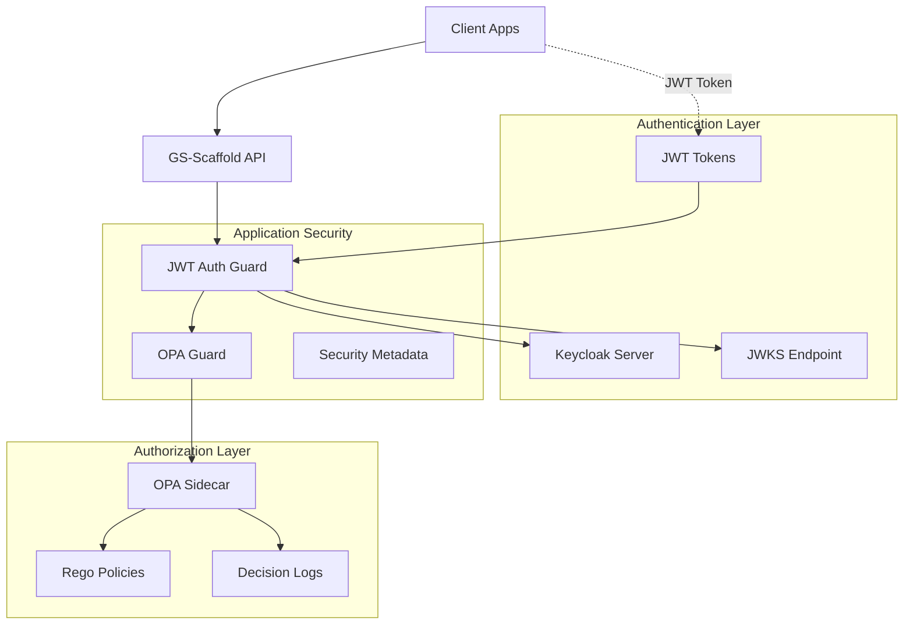

# Keycloak & OPA Integration Implementation Scaffold

## 📋 Executive Summary

This document provides a comprehensive implementation scaffold for integrating **Keycloak** (authentication) and **Open Policy Agent (OPA)** (authorization) into the GS-Scaffold NestJS application. The implementation follows enterprise security patterns with proper separation of concerns, zero-trust principles, and comprehensive audit trails.

## 🎯 Implementation Overview

### Security Architecture Integration



### Implementation Phases

1. **Phase 1**: Authentication Infrastructure (Keycloak JWT)
2. **Phase 2**: Authorization Framework (OPA Integration)
3. **Phase 3**: Security Metadata & Tracing
4. **Phase 4**: Data Protection & PII Handling
5. **Phase 5**: Audit & Decision Logging
6. **Phase 6**: Production Hardening

## 🔐 Phase 1: Authentication Infrastructure

### 1.1 JWT Strategy Implementation

```typescript
// src/security/auth/jwt.strategy.ts
import { Injectable, UnauthorizedException } from '@nestjs/common';
import { PassportStrategy } from '@nestjs/passport';
import { Strategy, ExtractJwt } from 'passport-jwt';
import { JwksClient } from 'jwks-rsa';
import { ConfigService } from '@nestjs/config';
import { IUserToken } from '../types/user-token.interface';
import { TokenToUserMapper } from './token-to-user.mapper';

@Injectable()
export class JwtStrategy extends PassportStrategy(Strategy) {
  private jwksClient: JwksClient;

  constructor(
    private readonly configService: ConfigService,
    private readonly tokenMapper: TokenToUserMapper,
  ) {
    const keycloakUrl = configService.get<string>('KEYCLOAK_URL');
    const realm = configService.get<string>('KEYCLOAK_REALM');
    const audience = configService.get<string>('JWT_AUDIENCE');

    super({
      jwtFromRequest: ExtractJwt.fromAuthHeaderAsBearerToken(),
      ignoreExpiration: false,
      issuer: `${keycloakUrl}/realms/${realm}`,
      audience: audience,
      algorithms: ['RS256'],
      secretOrKeyProvider: (request, rawJwtToken, done) => {
        this.getSigningKey(rawJwtToken, done);
      },
    });

    this.jwksClient = new JwksClient({
      jwksUri: `${keycloakUrl}/realms/${realm}/protocol/openid-connect/certs`,
      cache: true,
      cacheMaxAge: this.configService.get<number>(
        'JWKS_CACHE_MAX_AGE',
        3600000,
      ), // Default 1 hour, configurable for production
      rateLimit: true,
      jwksRequestsPerMinute: 10,
      jwksRequestsPerMinute: this.configService.get<number>(
        'JWKS_REQUESTS_PER_MINUTE',
        10,
      ),
      requestHeaders: {
        'User-Agent': 'gs-scaffold-api/1.0.0',
      },
      timeout: this.configService.get<number>('JWKS_TIMEOUT_MS', 30000),
    });
  }

  private async getSigningKey(token: string, done: Function) {
    try {
      const decoded = JSON.parse(
        Buffer.from(token.split('.')[0], 'base64').toString(),
      );
      const kid = decoded.kid;

      if (!kid) {
        return done(new UnauthorizedException('Token missing kid'), null);
      }

      const key = await this.jwksClient.getSigningKey(kid);
      const signingKey = key.getPublicKey();
      done(null, signingKey);
    } catch (error) {
      done(new UnauthorizedException('Invalid token signature'), null);
    }
  }

  async validate(payload: any): Promise<IUserToken> {
    try {
      // Validate token claims
      this.validateTokenClaims(payload);

      // Map JWT payload to IUserToken
      return this.tokenMapper.mapToUserToken(payload);
    } catch (error) {
      throw new UnauthorizedException('Token validation failed');
    }
  }

  private validateTokenClaims(payload: any): void {
    const now = Math.floor(Date.now() / 1000);

    // Check expiration
    if (payload.exp && payload.exp < now) {
      throw new UnauthorizedException('Token expired');
    }

    // Check not before
    if (payload.nbf && payload.nbf > now) {
      throw new UnauthorizedException('Token not yet valid');
    }

    // Check issued at
    if (payload.iat && payload.iat > now) {
      throw new UnauthorizedException('Token issued in future');
    }

    // Validate required claims
    if (!payload.sub) {
      throw new UnauthorizedException('Token missing subject');
    }

    // Validate audience claim
    const expectedAudience = this.configService.get<string>('JWT_AUDIENCE');
    if (expectedAudience && payload.aud) {
      const audiences = Array.isArray(payload.aud)
        ? payload.aud
        : [payload.aud];
      if (!audiences.includes(expectedAudience)) {
        throw new UnauthorizedException(
          `Invalid audience: expected ${expectedAudience}`,
        );
      }
    }

    // Validate issuer claim
    const expectedIssuer = `${this.configService.get<string>('KEYCLOAK_URL')}/realms/${this.configService.get<string>('KEYCLOAK_REALM')}`;
    if (payload.iss !== expectedIssuer) {
      throw new UnauthorizedException(
        `Invalid issuer: expected ${expectedIssuer}, got ${payload.iss}`,
      );
    }
  }
}
```

### 1.2 User Token Interface

```typescript
// src/security/types/user-token.interface.ts
export interface IUserToken {
  sub: string;
  name: string;
  email: string;
  preferred_username?: string;
  tenant?: string;
  tenant_id?: string;
  client_id?: string;
  roles?: string[];
  permissions?: string[];
}

export interface ISecurityContext {
  user: IUserToken;
  correlationId: string;
  traceId?: string;
  ipAddress?: string;
  userAgent?: string;
}
```

### 1.3 Token Mapper

```typescript
// src/security/auth/token-to-user.mapper.ts
import { Injectable } from '@nestjs/common';
import { IUserToken } from '../types/user-token.interface';

@Injectable()
export class TokenToUserMapper {
  mapToUserToken(jwtPayload: any): IUserToken {
    return {
      sub: jwtPayload.sub,
      name: jwtPayload.name || jwtPayload.preferred_username || 'Unknown',
      email: jwtPayload.email,
      preferred_username: jwtPayload.preferred_username,
      tenant: this.extractTenant(jwtPayload),
      tenant_id: jwtPayload.tenant_id,
      client_id: jwtPayload.azp || jwtPayload.client_id,
      roles: this.extractRoles(jwtPayload),
      permissions: this.extractPermissions(jwtPayload),
    };
  }

  private extractTenant(payload: any): string | undefined {
    // Priority: explicit tenant claim, tenant_id, or derive from client
    return payload.tenant || payload.tenant_id || payload.azp?.split('-')[0]; // Convention: client-id format
  }

  private extractRoles(payload: any): string[] {
    const roles: string[] = [];

    // Realm roles
    if (payload.realm_access?.roles) {
      roles.push(...payload.realm_access.roles);
    }

    // Resource/client roles
    if (payload.resource_access) {
      Object.values(payload.resource_access).forEach((access: any) => {
        if (access.roles) {
          roles.push(...access.roles);
        }
      });
    }

    return roles.filter(
      (role) => !['offline_access', 'uma_authorization'].includes(role),
    );
  }

  private extractPermissions(payload: any): string[] {
    // Extract custom permissions from token
    return payload.permissions || payload.scope?.split(' ') || [];
  }
}
```

### 1.4 JWT Authentication Guard

```typescript
// src/security/auth/jwt-auth.guard.ts
import {
  Injectable,
  ExecutionContext,
  UnauthorizedException,
} from '@nestjs/common';
import { AuthGuard } from '@nestjs/passport';
import { Reflector } from '@nestjs/core';
import { Request } from 'express';
import { IUserToken } from '../types/user-token.interface';

export interface AuthenticatedRequest extends Request {
  user: IUserToken;
}

@Injectable()
export class JwtAuthGuard extends AuthGuard('jwt') {
  constructor(private readonly reflector: Reflector) {
    super();
  }

  canActivate(context: ExecutionContext) {
    // Check if route is marked as public
    const isPublic = this.reflector.getAllAndOverride<boolean>('isPublic', [
      context.getHandler(),
      context.getClass(),
    ]);

    if (isPublic) {
      return true;
    }

    return super.canActivate(context);
  }

  handleRequest(err: any, user: any, info: any, context: ExecutionContext) {
    if (err || !user) {
      throw err || new UnauthorizedException('Authentication required');
    }
    return user;
  }
}
```

### 1.5 Current User Decorator

```typescript
// src/security/auth/current-user.decorator.ts
import { createParamDecorator, ExecutionContext } from '@nestjs/common';
import { IUserToken } from '../types/user-token.interface';

export const CurrentUser = createParamDecorator(
  (
    data: keyof IUserToken | undefined,
    ctx: ExecutionContext,
  ): IUserToken | any => {
    const request = ctx.switchToHttp().getRequest();
    const user = request.user;

    if (!user) {
      return null;
    }

    return data ? user[data] : user;
  },
);

export const Public = () =>
  Reflector.createDecorator<boolean>('isPublic', true);
```

## 🛡️ Phase 2: Authorization Framework (OPA)

### 2.1 OPA Client Implementation

```typescript
// src/security/opa/opa.client.ts
import { Injectable, Logger, HttpException, HttpStatus } from '@nestjs/common';
import { HttpService } from '@nestjs/axios';
import { ConfigService } from '@nestjs/config';
import { firstValueFrom, timeout, catchError } from 'rxjs';
import { of } from 'rxjs';
import * as crypto from 'crypto';

// Circuit Breaker Implementation
interface CircuitBreakerState {
  state: 'closed' | 'open' | 'half-open';
  failures: number;
  lastFailureTime: number;
  successCount: number;
}

class CircuitBreaker {
  private state: CircuitBreakerState = {
    state: 'closed',
    failures: 0,
    lastFailureTime: 0,
    successCount: 0,
  };

  constructor(
    private readonly failureThreshold: number = 5,
    private readonly recoveryTimeoutMs: number = 60000,
    private readonly successThreshold: number = 3,
  ) {}

  async execute<T>(fn: () => Promise<T>): Promise<T> {
    if (this.state.state === 'open') {
      if (Date.now() - this.state.lastFailureTime < this.recoveryTimeoutMs) {
        throw new Error('Circuit breaker is open');
      }
      this.state.state = 'half-open';
      this.state.successCount = 0;
    }

    try {
      const result = await fn();
      this.onSuccess();
      return result;
    } catch (error) {
      this.onFailure();
      throw error;
    }
  }

  private onSuccess(): void {
    if (this.state.state === 'half-open') {
      this.state.successCount++;
      if (this.state.successCount >= this.successThreshold) {
        this.state.state = 'closed';
        this.state.failures = 0;
      }
    } else {
      this.state.failures = 0;
    }
  }

  private onFailure(): void {
    this.state.failures++;
    this.state.lastFailureTime = Date.now();

    if (this.state.failures >= this.failureThreshold) {
      this.state.state = 'open';
    }
  }

  getState(): CircuitBreakerState {
    return { ...this.state };
  }
}

export interface OpaInput {
  subject: {
    id: string;
    tenant?: string;
    client_id?: string;
    roles: string[];
  };
  action: {
    type: string;
    name: string;
  };
  resource: {
    type: string;
    tenant?: string;
    ownerId?: string;
    [key: string]: any;
  };
  context: {
    correlationId: string;
    traceId?: string;
    time: string;
    ip?: string;
  };
  payload?: any;
}

export interface OpaDecision {
  allow: boolean;
  reason?: string;
  obligations?: {
    mask_fields?: string[];
    log_access?: boolean;
    require_mfa?: boolean;
    [key: string]: any;
  };
  policy_version?: string;
  policy_checksum?: string; // Added for audit compliance
  decision_id: string;
}

export interface OpaMetrics {
  totalCalls: number;
  allowCount: number;
  denyCount: number;
  errorCount: number;
  avgLatencyMs: number;
  circuitBreakerState: string;
}

@Injectable()
export class OpaClient {
  private readonly logger = new Logger(OpaClient.name);
  private readonly opaUrl: string;
  private readonly timeout: number;
  private readonly circuitBreaker: CircuitBreaker;
  private readonly metrics: OpaMetrics = {
    totalCalls: 0,
    allowCount: 0,
    denyCount: 0,
    errorCount: 0,
    avgLatencyMs: 0,
    circuitBreakerState: 'closed',
  };

  constructor(
    private readonly httpService: HttpService,
    private readonly configService: ConfigService,
  ) {
    this.opaUrl = this.configService.get<string>(
      'OPA_URL',
      'http://localhost:8181',
    );
    this.timeout = this.configService.get<number>('OPA_TIMEOUT_MS', 5000);

    // Configure circuit breaker
    const failureThreshold = this.configService.get<number>(
      'OPA_CIRCUIT_BREAKER_FAILURE_THRESHOLD',
      5,
    );
    const recoveryTimeout = this.configService.get<number>(
      'OPA_CIRCUIT_BREAKER_RECOVERY_TIMEOUT_MS',
      60000,
    );
    const successThreshold = this.configService.get<number>(
      'OPA_CIRCUIT_BREAKER_SUCCESS_THRESHOLD',
      3,
    );

    this.circuitBreaker = new CircuitBreaker(
      failureThreshold,
      recoveryTimeout,
      successThreshold,
    );
  }

  async evaluate(policyPath: string, input: OpaInput): Promise<OpaDecision> {
    const decisionId = crypto.randomUUID();
    const startTime = Date.now();

    try {
      this.logger.debug('OPA evaluation request', {
        policyPath,
        decisionId,
        correlationId: input.context.correlationId,
        subject: input.subject.id,
        action: input.action.name,
        resource: input.resource.type,
      });

      const decision = await this.circuitBreaker.execute(async () => {
        return this.performEvaluation(policyPath, input, decisionId);
      });

      const duration = Date.now() - startTime;
      this.updateMetrics(decision.allow, duration);
      this.logDecision(input, decision, duration);

      return decision;
    } catch (error) {
      const duration = Date.now() - startTime;
      this.metrics.errorCount++;
      this.metrics.circuitBreakerState = this.circuitBreaker.getState().state;

      this.logger.error('OPA client error', {
        error: error.message,
        decisionId,
        correlationId: input.context.correlationId,
        duration,
        circuitBreakerState: this.circuitBreaker.getState().state,
      });

      // Fail closed
      return {
        allow: false,
        reason: error.message.includes('Circuit breaker')
          ? 'Authorization service temporarily unavailable'
          : 'Authorization service error',
        decision_id: decisionId,
      };
    }
  }

  async evaluateBatch(
    policyPath: string,
    inputs: OpaInput[],
  ): Promise<OpaDecision[]> {
    const decisionId = crypto.randomUUID();
    const startTime = Date.now();

    try {
      this.logger.debug('OPA batch evaluation request', {
        policyPath,
        decisionId,
        batchSize: inputs.length,
      });

      const decisions = await this.circuitBreaker.execute(async () => {
        return this.performBatchEvaluation(policyPath, inputs, decisionId);
      });

      const duration = Date.now() - startTime;
      decisions.forEach((decision) =>
        this.updateMetrics(decision.allow, duration / inputs.length),
      );

      return decisions;
    } catch (error) {
      const duration = Date.now() - startTime;
      this.metrics.errorCount += inputs.length;

      this.logger.error('OPA batch client error', {
        error: error.message,
        decisionId,
        batchSize: inputs.length,
        duration,
      });

      // Fail closed for all inputs
      return inputs.map(() => ({
        allow: false,
        reason: 'Batch authorization service error',
        decision_id: `${decisionId}-batch`,
      }));
    }
  }

  getMetrics(): OpaMetrics {
    return {
      ...this.metrics,
      circuitBreakerState: this.circuitBreaker.getState().state,
    };
  }

  private async performEvaluation(
    policyPath: string,
    input: OpaInput,
    decisionId: string,
  ): Promise<OpaDecision> {
    const response$ = this.httpService
      .post(
        `${this.opaUrl}/v1/data/${policyPath.replace(/\./g, '/')}`,
        { input },
        {
          headers: {
            'Content-Type': 'application/json',
            'X-Request-ID': decisionId,
          },
        },
      )
      .pipe(
        timeout(this.timeout),
        catchError((error) => {
          throw new Error(`OPA evaluation failed: ${error.message}`);
        }),
      );

    const response = await firstValueFrom(response$);
    const result = response.data.result;

    return {
      allow: Boolean(result.allow),
      reason: result.reason,
      obligations: result.obligations,
      policy_version: result.policy_version,
      policy_checksum: this.calculatePolicyChecksum(result),
      decision_id: decisionId,
    };
  }

  private async performBatchEvaluation(
    policyPath: string,
    inputs: OpaInput[],
    decisionId: string,
  ): Promise<OpaDecision[]> {
    const batchInput = {
      inputs: inputs.map((input, index) => ({ id: index, input })),
    };

    const response$ = this.httpService
      .post(
        `${this.opaUrl}/v1/data/${policyPath.replace(/\./g, '/')}/batch`,
        batchInput,
        {
          headers: {
            'Content-Type': 'application/json',
            'X-Request-ID': decisionId,
          },
        },
      )
      .pipe(
        timeout(this.timeout * 2), // Longer timeout for batch
        catchError((error) => {
          throw new Error(`OPA batch evaluation failed: ${error.message}`);
        }),
      );

    const response = await firstValueFrom(response$);
    const results = response.data.result;

    return results.map((result: any, index: number) => ({
      allow: Boolean(result.allow),
      reason: result.reason,
      obligations: result.obligations,
      policy_version: result.policy_version,
      policy_checksum: this.calculatePolicyChecksum(result),
      decision_id: `${decisionId}-${index}`,
    }));
  }

  private calculatePolicyChecksum(result: any): string {
    // Create a deterministic checksum of policy content for audit trails
    const policyContent = JSON.stringify({
      version: result.policy_version,
      rules: result.policy_rules || {},
      timestamp: result.policy_timestamp,
    });
    return crypto
      .createHash('sha256')
      .update(policyContent)
      .digest('hex')
      .substring(0, 16);
  }

  private updateMetrics(allow: boolean, duration: number): void {
    this.metrics.totalCalls++;
    if (allow) {
      this.metrics.allowCount++;
    } else {
      this.metrics.denyCount++;
    }

    // Calculate running average latency
    this.metrics.avgLatencyMs =
      (this.metrics.avgLatencyMs * (this.metrics.totalCalls - 1) + duration) /
      this.metrics.totalCalls;
  }

  private logDecision(
    input: OpaInput,
    decision: OpaDecision,
    duration: number,
  ): void {
    this.logger.info('OPA decision', {
      decision_id: decision.decision_id,
      allow: decision.allow,
      reason: decision.reason,
      policy_version: decision.policy_version,
      policy_checksum: decision.policy_checksum,
      subject_id: input.subject.id,
      subject_tenant: input.subject.tenant,
      action: input.action.name,
      resource_type: input.resource.type,
      resource_tenant: input.resource.tenant,
      correlationId: input.context.correlationId,
      traceId: input.context.traceId,
      duration_ms: duration,
      obligations: decision.obligations,
    });
  }
}
```

### 2.2 OPA Authorization Guard

```typescript
// src/security/opa/opa.guard.ts
import {
  Injectable,
  CanActivate,
  ExecutionContext,
  ForbiddenException,
} from '@nestjs/common';
import { Reflector } from '@nestjs/core';
import { Request } from 'express';
import { OpaClient, OpaInput } from './opa.client';
import { IUserToken } from '../types/user-token.interface';
import { AuthenticatedRequest } from '../auth/jwt-auth.guard';

export interface ResourceMetadata {
  type: string;
  action: string;
  extractResource?: (req: Request) => any;
  supportsBatch?: boolean; // New: indicates if this endpoint supports batch processing
}

export interface BatchResourceMetadata extends ResourceMetadata {
  extractResources: (req: Request) => any[]; // Extract multiple resources for batch evaluation
}

@Injectable()
export class OpaGuard implements CanActivate {
  constructor(
    private readonly reflector: Reflector,
    private readonly opaClient: OpaClient,
  ) {}

  async canActivate(context: ExecutionContext): Promise<boolean> {
    // Skip if route is public
    const isPublic = this.reflector.getAllAndOverride<boolean>('isPublic', [
      context.getHandler(),
      context.getClass(),
    ]);

    if (isPublic) {
      return true;
    }

    const request = context.switchToHttp().getRequest<AuthenticatedRequest>();
    const user = request.user;

    if (!user) {
      throw new ForbiddenException('User not authenticated');
    }

    // Get resource metadata from decorator
    const resourceMeta = this.reflector.getAllAndOverride<
      ResourceMetadata | BatchResourceMetadata
    >('resource', [context.getHandler(), context.getClass()]);

    if (!resourceMeta) {
      // No OPA policy required for this route
      return true;
    }

    // Handle batch operations
    if (resourceMeta.supportsBatch && 'extractResources' in resourceMeta) {
      return this.handleBatchAuthorization(
        request,
        user,
        resourceMeta as BatchResourceMetadata,
      );
    }

    // Build OPA input for single resource
    const input = this.buildOpaInput(request, user, resourceMeta);

    // Evaluate policy
    const decision = await this.opaClient.evaluate(
      'authz.decisions.allow',
      input,
    );

    if (!decision.allow) {
      throw new ForbiddenException(decision.reason || 'Access denied');
    }

    // Attach obligations to request for downstream processing
    if (decision.obligations) {
      (request as any).obligations = decision.obligations;
    }

    return true;
  }

  private async handleBatchAuthorization(
    request: AuthenticatedRequest,
    user: IUserToken,
    resourceMeta: BatchResourceMetadata,
  ): Promise<boolean> {
    const resources = resourceMeta.extractResources(request);

    if (resources.length === 0) {
      return true; // No resources to authorize
    }

    // Build OPA inputs for batch evaluation
    const inputs = resources.map((resource) =>
      this.buildOpaInputForResource(request, user, resourceMeta, resource),
    );

    // Evaluate policies in batch
    const decisions = await this.opaClient.evaluateBatch(
      'authz.decisions.allow',
      inputs,
    );

    // Check if all decisions are allowed
    const deniedDecisions = decisions.filter((decision) => !decision.allow);

    if (deniedDecisions.length > 0) {
      const reasons = deniedDecisions.map((d) => d.reason).filter(Boolean);
      throw new ForbiddenException(
        `Access denied for ${deniedDecisions.length} resource(s): ${reasons.join(', ')}`,
      );
    }

    // Merge all obligations
    const allObligations = decisions
      .map((d) => d.obligations)
      .filter(Boolean)
      .reduce((merged, obligations) => {
        // Merge obligations intelligently
        Object.keys(obligations).forEach((key) => {
          if (Array.isArray(obligations[key])) {
            merged[key] = [...(merged[key] || []), ...obligations[key]];
          } else {
            merged[key] = obligations[key];
          }
        });
        return merged;
      }, {} as any);

    if (Object.keys(allObligations).length > 0) {
      (request as any).obligations = allObligations;
    }

    return true;
  }

  private buildOpaInput(
    request: AuthenticatedRequest,
    user: IUserToken,
    resourceMeta: ResourceMetadata,
  ): OpaInput {
    // Extract resource data
    let resourceData = {};
    if (resourceMeta.extractResource) {
      resourceData = resourceMeta.extractResource(request);
    } else {
      // Default extraction from params and body
      resourceData = {
        id: request.params?.id,
        ...request.body,
      };
    }

    return this.buildOpaInputForResource(
      request,
      user,
      resourceMeta,
      resourceData,
    );
  }

  private buildOpaInputForResource(
    request: AuthenticatedRequest,
    user: IUserToken,
    resourceMeta: ResourceMetadata,
    resourceData: any,
  ): OpaInput {
    const correlationId = this.getCorrelationId(request);
    const traceId = this.getTraceId(request);

    return {
      subject: {
        id: user.sub,
        tenant: user.tenant || user.tenant_id,
        client_id: user.client_id,
        roles: user.roles || [],
      },
      action: {
        type: 'http',
        name: resourceMeta.action,
      },
      resource: {
        type: resourceMeta.type,
        tenant: user.tenant || user.tenant_id,
        ...resourceData,
      },
      context: {
        correlationId,
        traceId,
        time: new Date().toISOString(),
        ip: this.getClientIp(request),
      },
      payload: request.body,
    };
  }

  private getCorrelationId(request: Request): string {
    return (
      (request.headers['x-correlation-id'] as string) ||
      (request as any).correlationId ||
      crypto.randomUUID()
    );
  }

  private getTraceId(request: Request): string | undefined {
    return (
      (request.headers['x-trace-id'] as string) || (request as any).traceId
    );
  }

  private getClientIp(request: Request): string | undefined {
    return (
      (request.headers['x-forwarded-for'] as string)?.split(',')[0] ||
      (request.headers['x-real-ip'] as string) ||
      request.ip ||
      request.connection.remoteAddress
    );
  }
}
```

### 2.3 Resource Decorator

```typescript
// src/security/opa/resource.decorator.ts
import { SetMetadata } from '@nestjs/common';
import { Request } from 'express';

export interface ResourceOptions {
  type: string;
  action: string;
  extractResource?: (req: Request) => any;
}

export const Resource = (options: ResourceOptions) =>
  SetMetadata('resource', options);

// Convenience decorators for common patterns
export const ProductResource = (action: string) =>
  Resource({
    type: 'product',
    action: `product.${action}`,
    extractResource: (req) => ({
      id: req.params.id,
      category: req.body?.category,
      ownerId: req.body?.ownerId,
    }),
  });

export const OrderResource = (action: string) =>
  Resource({
    type: 'order',
    action: `order.${action}`,
    extractResource: (req) => ({
      id: req.params.id,
      customerId: req.body?.customerId,
      status: req.body?.status,
    }),
  });

export const UserResource = (action: string) =>
  Resource({
    type: 'user',
    action: `user.${action}`,
    extractResource: (req) => ({
      id: req.params.id || req.body?.id,
      roles: req.body?.roles,
    }),
  });
```

## 📝 Phase 3: OPA Policies (Rego)

### 3.1 Main Authorization Policy

```rego
# policies/authz/decisions/allow.rego
package authz.decisions

import rego.v1

# Main authorization decision
allow if {
    input.subject.id != ""
    tenant_check
    action_allowed
    not explicitly_denied
}

# Tenant isolation - users can only access resources in their tenant
tenant_check if {
    input.subject.tenant == input.resource.tenant
}

tenant_check if {
    # Allow system/service accounts to access any tenant
    input.subject.client_id
    startswith(input.subject.client_id, "system-")
}

# Action-based authorization
action_allowed if {
    data.authz.actions.allow with input as input
}

# Explicit denials override everything
explicitly_denied if {
    data.authz.denials.deny with input as input
}

# Obligations for conditional access
obligations := data.authz.obligations.get_obligations with input as input
```

### 3.2 Role-Based Access Control

```rego
# policies/authz/roles.rego
package authz.roles

import rego.v1

# Role hierarchy
role_hierarchy := {
    "admin": ["manager", "user", "viewer"],
    "manager": ["user", "viewer"],
    "user": ["viewer"],
    "viewer": []
}

# Check if subject has required role (including inherited roles)
has_role(required_role) if {
    required_role in input.subject.roles
}

has_role(required_role) if {
    some user_role in input.subject.roles
    required_role in role_hierarchy[user_role]
}

# Product-specific roles
product_roles := {
    "product.create": ["admin", "manager"],
    "product.update": ["admin", "manager", "product-owner"],
    "product.delete": ["admin"],
    "product.view": ["admin", "manager", "user", "viewer"],
    "product.list": ["admin", "manager", "user", "viewer"]
}

# Order-specific roles
order_roles := {
    "order.create": ["admin", "manager", "sales"],
    "order.update": ["admin", "manager", "sales"],
    "order.cancel": ["admin", "manager"],
    "order.view": ["admin", "manager", "sales", "customer"],
    "order.list": ["admin", "manager", "sales"]
}

# User management roles
user_roles := {
    "user.create": ["admin"],
    "user.update": ["admin", "manager"],
    "user.delete": ["admin"],
    "user.view": ["admin", "manager", "user"],
    "user.list": ["admin", "manager"]
}
```

### 3.3 Action Authorization

```rego
# policies/authz/actions.rego
package authz.actions

import rego.v1

# Action authorization decision
allow if {
    role_based_access
}

allow if {
    attribute_based_access
}

# Role-based access control
role_based_access if {
    required_roles := data.authz.roles.product_roles[input.action.name]
    some required_role in required_roles
    data.authz.roles.has_role(required_role)
}

role_based_access if {
    required_roles := data.authz.roles.order_roles[input.action.name]
    some required_role in required_roles
    data.authz.roles.has_role(required_role)
}

role_based_access if {
    required_roles := data.authz.roles.user_roles[input.action.name]
    some required_role in required_roles
    data.authz.roles.has_role(required_role)
}

# Attribute-based access control
attribute_based_access if {
    input.action.name == "product.update"
    input.resource.ownerId == input.subject.id
}

attribute_based_access if {
    input.action.name == "order.view"
    input.resource.customerId == input.subject.id
}

attribute_based_access if {
    input.action.name == "user.view"
    input.resource.id == input.subject.id
}
```

### 3.4 Obligations and Field Masking

```rego
# policies/authz/obligations.rego
package authz.obligations

import rego.v1

# Get obligations for conditional access
get_obligations := obligations if {
    obligations := {
        "mask_fields": mask_fields,
        "log_access": log_access,
        "require_mfa": require_mfa
    }
}

# Field masking based on roles and data sensitivity
mask_fields contains field if {
    input.action.name in ["product.view", "product.list"]
    not data.authz.roles.has_role("manager")
    field in ["cost", "internalNotes", "supplierInfo"]
}

mask_fields contains field if {
    input.action.name in ["user.view", "user.list"]
    not data.authz.roles.has_role("admin")
    input.resource.id != input.subject.id
    field in ["email", "phone", "address"]
}

mask_fields contains field if {
    input.action.name in ["order.view", "order.list"]
    not data.authz.roles.has_role("manager")
    input.resource.customerId != input.subject.id
    field in ["paymentMethod", "billingAddress"]
}

# Audit logging requirements
log_access if {
    input.action.name in ["user.view", "user.update", "user.delete"]
}

log_access if {
    input.resource.type == "order"
    data.authz.roles.has_role("admin")
}

# MFA requirements for sensitive operations
require_mfa if {
    input.action.name in ["user.delete", "product.delete", "order.cancel"]
    data.authz.roles.has_role("admin")
}

require_mfa if {
    input.action.name == "user.update"
    "admin" in input.subject.roles
    input.resource.roles
    "admin" in input.resource.roles
}
```

## 🛠️ Phase 4: Implementation Integration

### 4.1 Security Module

```typescript
// src/security/security.module.ts
import { Module } from '@nestjs/common';
import { PassportModule } from '@nestjs/passport';
import { HttpModule } from '@nestjs/axios';
import { JwtStrategy } from './auth/jwt.strategy';
import { JwtAuthGuard } from './auth/jwt-auth.guard';
import { OpaClient } from './opa/opa.client';
import { OpaGuard } from './opa/opa.guard';
import { TokenToUserMapper } from './auth/token-to-user.mapper';
import { SecurityMetadataService } from './metadata/security-metadata.service';
import { TraceMiddleware } from './middleware/trace.middleware';

@Module({
  imports: [
    PassportModule.register({ defaultStrategy: 'jwt' }),
    HttpModule.register({
      timeout: 5000,
      maxRedirects: 0,
    }),
  ],
  providers: [
    JwtStrategy,
    JwtAuthGuard,
    OpaClient,
    OpaGuard,
    TokenToUserMapper,
    SecurityMetadataService,
    TraceMiddleware,
  ],
  exports: [
    JwtAuthGuard,
    OpaGuard,
    OpaClient,
    SecurityMetadataService,
    TraceMiddleware,
  ],
})
export class SecurityModule {}
```

### 4.2 Security Metadata Service

```typescript
// src/security/metadata/security-metadata.service.ts
import { Injectable } from '@nestjs/common';
import { AsyncLocalStorage } from 'async_hooks';
import { IUserToken } from '../types/user-token.interface';

export interface EventMetadata {
  correlationId: string;
  causationId?: string;
  tenant: string;
  user?: {
    id: string;
    email?: string;
    name?: string;
  };
  source: string;
  occurredAt: string;
  traceId?: string;
  originalClaims?: Record<string, any>; // Redacted JWT claims for audit
}

export interface StandardJobMetadata {
  correlationId: string;
  source: string;
  timestamp: string;
  user?: {
    id: string;
    email?: string;
    tenant?: string;
  };
  businessContext?: Record<string, any>;
  traceId?: string;
  originalClaims?: Record<string, any>;
}

interface TraceContext {
  traceId: string;
  spanId?: string;
  correlationId: string;
  user?: IUserToken;
  originalClaims?: Record<string, any>;
}

@Injectable()
export class SecurityMetadataService {
  private readonly asyncLocalStorage = new AsyncLocalStorage<TraceContext>();

  setTraceContext(context: TraceContext): void {
    this.asyncLocalStorage.enterWith(context);
  }

  getTraceContext(): TraceContext | undefined {
    return this.asyncLocalStorage.getStore();
  }

  buildEventMetadata(
    user: IUserToken | undefined,
    source: string,
    correlationId?: string,
    causationId?: string,
  ): EventMetadata {
    const context = this.getTraceContext();

    return {
      correlationId:
        correlationId ?? context?.correlationId ?? crypto.randomUUID(),
      causationId,
      source,
      occurredAt: new Date().toISOString(),
      user: user && {
        id: user.sub,
        email: user.email,
        name: user.name,
      },
      tenant: user?.tenant ?? user?.tenant_id ?? 'unknown',
      traceId: context?.traceId ?? this.generateTraceId(),
      originalClaims: this.sanitizeClaimsForAudit(context?.originalClaims),
    };
  }

  buildJobMetadata(
    user: IUserToken | undefined,
    source: string,
    businessContext?: Record<string, any>,
  ): StandardJobMetadata {
    const context = this.getTraceContext();

    return {
      correlationId: context?.correlationId ?? crypto.randomUUID(),
      source,
      timestamp: new Date().toISOString(),
      user: user && {
        id: user.sub,
        email: user.email,
        tenant: user.tenant ?? user.tenant_id,
      },
      businessContext,
      traceId: context?.traceId ?? this.generateTraceId(),
      originalClaims: this.sanitizeClaimsForAudit(context?.originalClaims),
    };
  }

  private generateTraceId(): string {
    // Generate W3C-compatible trace ID (32 hex characters)
    return crypto.randomBytes(16).toString('hex');
  }

  private sanitizeClaimsForAudit(
    claims?: Record<string, any>,
  ): Record<string, any> | undefined {
    if (!claims) return undefined;

    // Remove sensitive claims for audit logging
    const sanitized = { ...claims };
    const sensitiveFields = [
      'access_token',
      'refresh_token',
      'id_token',
      'password',
      'client_secret',
      'private_key',
    ];

    sensitiveFields.forEach((field) => {
      if (field in sanitized) {
        sanitized[field] = '[REDACTED]';
      }
    });

    // Keep only audit-relevant claims
    const auditClaims = {
      iss: sanitized.iss,
      aud: sanitized.aud,
      exp: sanitized.exp,
      iat: sanitized.iat,
      auth_time: sanitized.auth_time,
      acr: sanitized.acr,
      amr: sanitized.amr,
      azp: sanitized.azp,
      scope: sanitized.scope,
      session_state: sanitized.session_state,
    };

    // Remove undefined values
    return Object.fromEntries(
      Object.entries(auditClaims).filter(([_, value]) => value !== undefined),
    );
  }
}
```

### 4.3 Example Controller Implementation

```typescript
// src/product/product.controller.ts
import {
  Controller,
  Get,
  Post,
  Put,
  Delete,
  Param,
  Body,
  UseGuards,
} from '@nestjs/common';
import { ApiTags, ApiBearerAuth } from '@nestjs/swagger';
import { JwtAuthGuard } from '../security/auth/jwt-auth.guard';
import { OpaGuard } from '../security/opa/opa.guard';
import { CurrentUser } from '../security/auth/current-user.decorator';
import { ProductResource } from '../security/opa/resource.decorator';
import { IUserToken } from '../security/types/user-token.interface';
import { ProductService } from './product.service';
import { CreateProductDto, UpdateProductDto } from './dto';

@ApiTags('products')
@ApiBearerAuth()
@Controller('products')
@UseGuards(JwtAuthGuard, OpaGuard)
export class ProductController {
  constructor(private readonly productService: ProductService) {}

  @Get()
  @ProductResource('list')
  async findAll(@CurrentUser() user: IUserToken) {
    return this.productService.findAll(user);
  }

  @Get(':id')
  @ProductResource('view')
  async findOne(@Param('id') id: string, @CurrentUser() user: IUserToken) {
    return this.productService.findOne(id, user);
  }

  @Post()
  @ProductResource('create')
  async create(
    @Body() createProductDto: CreateProductDto,
    @CurrentUser() user: IUserToken,
  ) {
    return this.productService.create(createProductDto, user);
  }

  @Put(':id')
  @ProductResource('update')
  async update(
    @Param('id') id: string,
    @Body() updateProductDto: UpdateProductDto,
    @CurrentUser() user: IUserToken,
  ) {
    return this.productService.update(id, updateProductDto, user);
  }

  @Delete(':id')
  @ProductResource('delete')
  async remove(@Param('id') id: string, @CurrentUser() user: IUserToken) {
    return this.productService.remove(id, user);
  }
}
```

## 🐳 Phase 5: Docker & Infrastructure

### 5.1 Keycloak Development Setup

```yaml
# docker-compose.keycloak.yml
version: '3.8'

services:
  keycloak-db:
    image: postgres:14
    environment:
      POSTGRES_DB: keycloak
      POSTGRES_USER: keycloak
      POSTGRES_PASSWORD: password
    volumes:
      - keycloak_db_data:/var/lib/postgresql/data
    networks:
      - security-network

  keycloak:
    image: quay.io/keycloak/keycloak:22.0
    environment:
      KC_DB: postgres
      KC_DB_URL: jdbc:postgresql://keycloak-db:5432/keycloak
      KC_DB_USERNAME: keycloak
      KC_DB_PASSWORD: password
      KC_HOSTNAME: localhost
      KEYCLOAK_ADMIN: admin
      KEYCLOAK_ADMIN_PASSWORD: admin123
    ports:
      - '8080:8080'
    depends_on:
      - keycloak-db
    command: start-dev
    networks:
      - security-network

  opa:
    image: openpolicyagent/opa:latest-envoy
    ports:
      - '8181:8181'
    command:
      - 'run'
      - '--server'
      - '--log-level=debug'
      - '--set=decision_logs.console=true'
      - '/policies'
    volumes:
      - ./policies:/policies
    networks:
      - security-network

volumes:
  keycloak_db_data:

networks:
  security-network:
    driver: bridge
```

### 5.2 Updated Main Docker Compose

```yaml
# docker-compose.yml (additions)
services:
  # ... existing services ...

  keycloak:
    extends:
      file: docker-compose.keycloak.yml
      service: keycloak
    labels:
      - 'app=gs-scaffold'
      - 'service=keycloak'
      - 'environment=development'

  opa:
    extends:
      file: docker-compose.keycloak.yml
      service: opa
    labels:
      - 'app=gs-scaffold'
      - 'service=opa'
      - 'environment=development'

  gs-scaffold:
    # ... existing configuration ...
    environment:
      # ... existing environment variables ...
      - KEYCLOAK_URL=http://keycloak:8080
      - KEYCLOAK_REALM=gs-scaffold
      - JWT_AUDIENCE=gs-scaffold-api
      - OPA_URL=http://opa:8181
      - OPA_TIMEOUT_MS=5000
    depends_on:
      - loki
      - keycloak
      - opa
```

## 📚 Phase 6: Configuration & Environment

### 6.1 Environment Configuration

```typescript
// src/config/security.config.ts
import { registerAs } from '@nestjs/config';

export default registerAs('security', () => ({
  keycloak: {
    url: process.env.KEYCLOAK_URL || 'http://localhost:8080',
    realm: process.env.KEYCLOAK_REALM || 'gs-scaffold',
    clientId: process.env.KEYCLOAK_CLIENT_ID || 'gs-scaffold-api',
    clientSecret: process.env.KEYCLOAK_CLIENT_SECRET,
  },
  jwt: {
    audience: process.env.JWT_AUDIENCE || 'gs-scaffold-api',
    issuer: `${process.env.KEYCLOAK_URL || 'http://localhost:8080'}/realms/${process.env.KEYCLOAK_REALM || 'gs-scaffold'}`,
  },
  opa: {
    url: process.env.OPA_URL || 'http://localhost:8181',
    timeout: parseInt(process.env.OPA_TIMEOUT_MS || '5000', 10),
    enableDecisionLogs: process.env.OPA_DECISION_LOGS === 'true',
  },
  cors: {
    allowedOrigins: process.env.CORS_ALLOWED_ORIGINS?.split(',') || [
      'http://localhost:3000',
    ],
    allowCredentials: process.env.CORS_ALLOW_CREDENTIALS === 'true',
  },
}));
```

### 6.2 Environment Variables

```bash
# .env.development
# Keycloak Configuration
KEYCLOAK_URL=http://localhost:8080
KEYCLOAK_REALM=gs-scaffold
KEYCLOAK_CLIENT_ID=gs-scaffold-api
KEYCLOAK_CLIENT_SECRET=your-client-secret

# JWT Configuration
JWT_AUDIENCE=gs-scaffold-api

# OPA Configuration
OPA_URL=http://localhost:8181
OPA_TIMEOUT_MS=5000
OPA_DECISION_LOGS=true

# CORS Configuration
CORS_ALLOWED_ORIGINS=http://localhost:3000,http://localhost:3001
CORS_ALLOW_CREDENTIALS=true
```

## 🧪 Phase 7: Testing Strategy

### 7.1 Authentication Tests

```typescript
// src/security/auth/__tests__/jwt.strategy.spec.ts
import { Test, TestingModule } from '@nestjs/testing';
import { UnauthorizedException } from '@nestjs/common';
import { ConfigService } from '@nestjs/config';
import { JwtStrategy } from '../jwt.strategy';
import { TokenToUserMapper } from '../token-to-user.mapper';

describe('JwtStrategy', () => {
  let strategy: JwtStrategy;
  let configService: ConfigService;
  let tokenMapper: TokenToUserMapper;

  beforeEach(async () => {
    const module: TestingModule = await Test.createTestingModule({
      providers: [
        JwtStrategy,
        {
          provide: ConfigService,
          useValue: {
            get: jest.fn((key: string) => {
              const config = {
                KEYCLOAK_URL: 'http://localhost:8080',
                KEYCLOAK_REALM: 'test-realm',
                JWT_AUDIENCE: 'test-audience',
                JWKS_CACHE_MAX_AGE: 3600000,
                JWKS_REQUESTS_PER_MINUTE: 10,
                JWKS_TIMEOUT_MS: 30000,
              };
              return config[key];
            }),
          },
        },
        {
          provide: TokenToUserMapper,
          useValue: {
            mapToUserToken: jest.fn(),
          },
        },
      ],
    }).compile();

    strategy = module.get<JwtStrategy>(JwtStrategy);
    configService = module.get<ConfigService>(ConfigService);
    tokenMapper = module.get<TokenToUserMapper>(TokenToUserMapper);
  });

  describe('validate', () => {
    it('should validate a valid token payload', async () => {
      const mockPayload = {
        sub: 'user-123',
        exp: Math.floor(Date.now() / 1000) + 3600,
        iat: Math.floor(Date.now() / 1000),
        aud: 'test-audience',
        iss: 'http://localhost:8080/realms/test-realm',
      };

      const mockUser = {
        sub: 'user-123',
        name: 'Test User',
        email: 'test@example.com',
      };

      jest.spyOn(tokenMapper, 'mapToUserToken').mockReturnValue(mockUser);

      const result = await strategy.validate(mockPayload);

      expect(result).toEqual(mockUser);
      expect(tokenMapper.mapToUserToken).toHaveBeenCalledWith(mockPayload);
    });

    it('should throw UnauthorizedException for expired token', async () => {
      const mockPayload = {
        sub: 'user-123',
        exp: Math.floor(Date.now() / 1000) - 3600, // Expired
        iat: Math.floor(Date.now() / 1000) - 7200,
        aud: 'test-audience',
        iss: 'http://localhost:8080/realms/test-realm',
      };

      await expect(strategy.validate(mockPayload)).rejects.toThrow(
        UnauthorizedException,
      );
    });

    it('should throw UnauthorizedException for token without subject', async () => {
      const mockPayload = {
        exp: Math.floor(Date.now() / 1000) + 3600,
        iat: Math.floor(Date.now() / 1000),
        aud: 'test-audience',
        iss: 'http://localhost:8080/realms/test-realm',
      };

      await expect(strategy.validate(mockPayload)).rejects.toThrow(
        UnauthorizedException,
      );
    });

    it('should throw UnauthorizedException for wrong audience', async () => {
      const mockPayload = {
        sub: 'user-123',
        exp: Math.floor(Date.now() / 1000) + 3600,
        iat: Math.floor(Date.now() / 1000),
        aud: 'wrong-audience',
        iss: 'http://localhost:8080/realms/test-realm',
      };

      await expect(strategy.validate(mockPayload)).rejects.toThrow(
        UnauthorizedException,
      );
    });

    it('should throw UnauthorizedException for wrong issuer', async () => {
      const mockPayload = {
        sub: 'user-123',
        exp: Math.floor(Date.now() / 1000) + 3600,
        iat: Math.floor(Date.now() / 1000),
        aud: 'test-audience',
        iss: 'http://evil.com/realms/test-realm',
      };

      await expect(strategy.validate(mockPayload)).rejects.toThrow(
        UnauthorizedException,
      );
    });
  });
});
```

### 7.2 OPA Integration Tests

```typescript
// src/security/opa/__tests__/opa.integration.spec.ts
import { Test, TestingModule } from '@nestjs/testing';
import { HttpService } from '@nestjs/axios';
import { ConfigService } from '@nestjs/config';
import { of, throwError } from 'rxjs';
import { OpaClient, OpaInput } from '../opa.client';

describe('OpaClient Integration', () => {
  let client: OpaClient;
  let httpService: HttpService;

  beforeEach(async () => {
    const module: TestingModule = await Test.createTestingModule({
      providers: [
        OpaClient,
        {
          provide: HttpService,
          useValue: {
            post: jest.fn(),
          },
        },
        {
          provide: ConfigService,
          useValue: {
            get: jest.fn((key: string, defaultValue?: any) => {
              const config = {
                OPA_URL: 'http://localhost:8181',
                OPA_TIMEOUT_MS: 5000,
                OPA_CIRCUIT_BREAKER_FAILURE_THRESHOLD: 5,
                OPA_CIRCUIT_BREAKER_RECOVERY_TIMEOUT_MS: 60000,
                OPA_CIRCUIT_BREAKER_SUCCESS_THRESHOLD: 3,
              };
              return config[key] || defaultValue;
            }),
          },
        },
      ],
    }).compile();

    client = module.get<OpaClient>(OpaClient);
    httpService = module.get<HttpService>(HttpService);
  });

  describe('evaluate', () => {
    it('should allow access for valid policy decision', async () => {
      const mockInput: OpaInput = {
        subject: {
          id: 'user-123',
          tenant: 'tenant-1',
          roles: ['manager'],
        },
        action: {
          type: 'http',
          name: 'product.view',
        },
        resource: {
          type: 'product',
          tenant: 'tenant-1',
          id: 'product-123',
        },
        context: {
          correlationId: 'corr-123',
          time: new Date().toISOString(),
        },
      };

      const mockResponse = {
        data: {
          result: {
            allow: true,
            policy_version: '1.0.0',
            policy_rules: { example: 'rule' },
            policy_timestamp: new Date().toISOString(),
          },
        },
      };

      jest.spyOn(httpService, 'post').mockReturnValue(of(mockResponse));

      const decision = await client.evaluate(
        'authz.decisions.allow',
        mockInput,
      );

      expect(decision.allow).toBe(true);
      expect(decision.policy_version).toBe('1.0.0');
      expect(decision.policy_checksum).toBeDefined();
      expect(httpService.post).toHaveBeenCalledWith(
        'http://localhost:8181/v1/data/authz/decisions/allow',
        { input: mockInput },
        expect.any(Object),
      );
    });

    it('should deny access and provide reason', async () => {
      const mockInput: OpaInput = {
        subject: {
          id: 'user-123',
          tenant: 'tenant-1',
          roles: ['viewer'],
        },
        action: {
          type: 'http',
          name: 'product.delete',
        },
        resource: {
          type: 'product',
          tenant: 'tenant-1',
          id: 'product-123',
        },
        context: {
          correlationId: 'corr-123',
          time: new Date().toISOString(),
        },
      };

      const mockResponse = {
        data: {
          result: {
            allow: false,
            reason: 'Insufficient privileges for product deletion',
            policy_version: '1.0.0',
          },
        },
      };

      jest.spyOn(httpService, 'post').mockReturnValue(of(mockResponse));

      const decision = await client.evaluate(
        'authz.decisions.allow',
        mockInput,
      );

      expect(decision.allow).toBe(false);
      expect(decision.reason).toBe(
        'Insufficient privileges for product deletion',
      );
    });

    it('should handle circuit breaker open state', async () => {
      const mockInput: OpaInput = {
        subject: { id: 'user-123', tenant: 'tenant-1', roles: ['viewer'] },
        action: { type: 'http', name: 'product.view' },
        resource: { type: 'product', tenant: 'tenant-1', id: 'product-123' },
        context: { correlationId: 'corr-123', time: new Date().toISOString() },
      };

      // Simulate failures to open circuit breaker
      jest
        .spyOn(httpService, 'post')
        .mockReturnValue(throwError(() => new Error('Service unavailable')));

      // First 5 calls should fail and open the circuit
      for (let i = 0; i < 5; i++) {
        const decision = await client.evaluate(
          'authz.decisions.allow',
          mockInput,
        );
        expect(decision.allow).toBe(false);
        expect(decision.reason).toContain('Authorization service');
      }

      // 6th call should be denied by circuit breaker
      const decision = await client.evaluate(
        'authz.decisions.allow',
        mockInput,
      );
      expect(decision.allow).toBe(false);
      expect(decision.reason).toBe(
        'Authorization service temporarily unavailable',
      );

      const metrics = client.getMetrics();
      expect(metrics.circuitBreakerState).toBe('open');
      expect(metrics.errorCount).toBeGreaterThan(0);
    });
  });

  describe('evaluateBatch', () => {
    it('should handle batch authorization', async () => {
      const mockInputs: OpaInput[] = [
        {
          subject: { id: 'user-123', tenant: 'tenant-1', roles: ['manager'] },
          action: { type: 'http', name: 'product.view' },
          resource: { type: 'product', tenant: 'tenant-1', id: 'product-1' },
          context: {
            correlationId: 'corr-123',
            time: new Date().toISOString(),
          },
        },
        {
          subject: { id: 'user-123', tenant: 'tenant-1', roles: ['manager'] },
          action: { type: 'http', name: 'product.view' },
          resource: { type: 'product', tenant: 'tenant-1', id: 'product-2' },
          context: {
            correlationId: 'corr-123',
            time: new Date().toISOString(),
          },
        },
      ];

      const mockResponse = {
        data: {
          result: [
            { allow: true, policy_version: '1.0.0' },
            {
              allow: false,
              reason: 'Product not found',
              policy_version: '1.0.0',
            },
          ],
        },
      };

      jest.spyOn(httpService, 'post').mockReturnValue(of(mockResponse));

      const decisions = await client.evaluateBatch(
        'authz.decisions.allow',
        mockInputs,
      );

      expect(decisions).toHaveLength(2);
      expect(decisions[0].allow).toBe(true);
      expect(decisions[1].allow).toBe(false);
      expect(decisions[1].reason).toBe('Product not found');
    });
  });
});
```

### 7.3 OPA Policy Unit Tests

```rego
# policies/authz/__tests__/decisions_test.rego
package authz.decisions

import rego.v1

# Test tenant isolation
test_tenant_isolation_allow if {
    allow with input as {
        "subject": {"id": "user-1", "tenant": "tenant-a", "roles": ["manager"]},
        "action": {"type": "http", "name": "product.view"},
        "resource": {"type": "product", "tenant": "tenant-a", "id": "product-1"}
    }
}

test_tenant_isolation_deny if {
    not allow with input as {
        "subject": {"id": "user-1", "tenant": "tenant-a", "roles": ["manager"]},
        "action": {"type": "http", "name": "product.view"},
        "resource": {"type": "product", "tenant": "tenant-b", "id": "product-1"}
    }
}

# Test system account bypass
test_system_account_bypass if {
    allow with input as {
        "subject": {"id": "system-service", "client_id": "system-analytics", "tenant": "tenant-a", "roles": ["system"]},
        "action": {"type": "http", "name": "product.view"},
        "resource": {"type": "product", "tenant": "tenant-b", "id": "product-1"}
    }
}

# Test role-based access
test_admin_product_delete if {
    allow with input as {
        "subject": {"id": "user-1", "tenant": "tenant-a", "roles": ["admin"]},
        "action": {"type": "http", "name": "product.delete"},
        "resource": {"type": "product", "tenant": "tenant-a", "id": "product-1"}
    }
}

test_viewer_product_delete_deny if {
    not allow with input as {
        "subject": {"id": "user-1", "tenant": "tenant-a", "roles": ["viewer"]},
        "action": {"type": "http", "name": "product.delete"},
        "resource": {"type": "product", "tenant": "tenant-a", "id": "product-1"}
    }
}

# Test attribute-based access
test_owner_product_update if {
    allow with input as {
        "subject": {"id": "user-1", "tenant": "tenant-a", "roles": ["user"]},
        "action": {"type": "http", "name": "product.update"},
        "resource": {"type": "product", "tenant": "tenant-a", "id": "product-1", "ownerId": "user-1"}
    }
}

test_non_owner_product_update_deny if {
    not allow with input as {
        "subject": {"id": "user-1", "tenant": "tenant-a", "roles": ["user"]},
        "action": {"type": "http", "name": "product.update"},
        "resource": {"type": "product", "tenant": "tenant-a", "id": "product-1", "ownerId": "user-2"}
    }
}
```

### 7.4 End-to-End Security Tests

```typescript
// test/security/security.e2e-spec.ts
import { Test, TestingModule } from '@nestjs/testing';
import { INestApplication } from '@nestjs/common';
import * as request from 'supertest';
import { AppModule } from '../../src/app.module';
import { SecurityModule } from '../../src/security/security.module';

describe('Security E2E Tests', () => {
  let app: INestApplication;
  let validJwt: string;
  let invalidJwt: string;

  beforeAll(async () => {
    const moduleFixture: TestingModule = await Test.createTestingModule({
      imports: [AppModule, SecurityModule],
    }).compile();

    app = moduleFixture.createNestApplication();
    await app.init();

    // Generate test JWTs (in real tests, these would come from test Keycloak)
    validJwt = await generateTestJWT({
      sub: 'test-user-123',
      name: 'Test User',
      email: 'test@example.com',
      tenant: 'test-tenant',
      roles: ['manager'],
      aud: 'gs-scaffold-api',
      iss: 'http://localhost:8080/realms/gs-scaffold',
    });

    invalidJwt = 'invalid.jwt.token';
  });

  afterAll(async () => {
    await app.close();
  });

  describe('JWT Authentication', () => {
    it('should reject requests without JWT', () => {
      return request(app.getHttpServer()).get('/products').expect(401);
    });

    it('should reject requests with invalid JWT', () => {
      return request(app.getHttpServer())
        .get('/products')
        .set('Authorization', `Bearer ${invalidJwt}`)
        .expect(401);
    });

    it('should accept requests with valid JWT', () => {
      return request(app.getHttpServer())
        .get('/products')
        .set('Authorization', `Bearer ${validJwt}`)
        .expect(200);
    });
  });

  describe('OPA Authorization', () => {
    it('should allow manager to view products', () => {
      return request(app.getHttpServer())
        .get('/products/123')
        .set('Authorization', `Bearer ${validJwt}`)
        .expect(200);
    });

    it('should deny viewer from deleting products', async () => {
      const viewerJwt = await generateTestJWT({
        sub: 'viewer-user',
        name: 'Viewer User',
        email: 'viewer@example.com',
        tenant: 'test-tenant',
        roles: ['viewer'],
        aud: 'gs-scaffold-api',
        iss: 'http://localhost:8080/realms/gs-scaffold',
      });

      return request(app.getHttpServer())
        .delete('/products/123')
        .set('Authorization', `Bearer ${viewerJwt}`)
        .expect(403);
    });

    it('should enforce tenant isolation', async () => {
      const otherTenantJwt = await generateTestJWT({
        sub: 'other-user',
        name: 'Other User',
        email: 'other@example.com',
        tenant: 'other-tenant',
        roles: ['admin'],
        aud: 'gs-scaffold-api',
        iss: 'http://localhost:8080/realms/gs-scaffold',
      });

      return request(app.getHttpServer())
        .get('/products/123') // Product belongs to test-tenant
        .set('Authorization', `Bearer ${otherTenantJwt}`)
        .expect(403);
    });
  });

  describe('Trace Context', () => {
    it('should propagate correlation ID through request', () => {
      const correlationId = 'test-correlation-123';

      return request(app.getHttpServer())
        .get('/products')
        .set('Authorization', `Bearer ${validJwt}`)
        .set('X-Correlation-ID', correlationId)
        .expect(200)
        .expect((res) => {
          // Verify correlation ID is in response headers or logs
          expect(res.headers['x-correlation-id']).toBe(correlationId);
        });
    });
  });

  async function generateTestJWT(payload: any): Promise<string> {
    // This would use a test signing key in real implementation
    // For now, return a mock JWT that passes validation in test environment
    const header = Buffer.from(
      JSON.stringify({ alg: 'RS256', typ: 'JWT', kid: 'test-key' }),
    ).toString('base64url');
    const body = Buffer.from(
      JSON.stringify({
        ...payload,
        exp: Math.floor(Date.now() / 1000) + 3600,
        iat: Math.floor(Date.now() / 1000),
      }),
    ).toString('base64url');
    const signature = 'test-signature';

    return `${header}.${body}.${signature}`;
  }
});
```

## 🔧 Phase 8: Enhanced Security Components

### 8.1 Composite Security Guard

```typescript
// src/security/guards/composite-security.guard.ts
import { Injectable, CanActivate, ExecutionContext } from '@nestjs/common';
import { JwtAuthGuard } from '../auth/jwt-auth.guard';
import { OpaGuard } from '../opa/opa.guard';

@Injectable()
export class CompositeSecurityGuard implements CanActivate {
  constructor(
    private readonly jwtAuthGuard: JwtAuthGuard,
    private readonly opaGuard: OpaGuard,
  ) {}

  async canActivate(context: ExecutionContext): Promise<boolean> {
    // First, check JWT authentication
    const isAuthenticated = await this.jwtAuthGuard.canActivate(context);
    if (!isAuthenticated) {
      return false;
    }

    // Then, check OPA authorization
    const isAuthorized = await this.opaGuard.canActivate(context);
    return isAuthorized;
  }
}

// Convenience decorator for common usage
export const SecuredEndpoint = (resourceType: string, action: string) => {
  return (
    target: any,
    propertyName: string,
    descriptor: PropertyDescriptor,
  ) => {
    // Apply both guards and resource metadata
    Reflect.defineMetadata(
      'guards',
      [CompositeSecurityGuard],
      descriptor.value,
    );
    Reflect.defineMetadata(
      'resource',
      { type: resourceType, action },
      descriptor.value,
    );
  };
};
```

### 8.2 Enhanced Resource Decorators with Batch Support

```typescript
// src/security/opa/enhanced-resource.decorator.ts
import { SetMetadata } from '@nestjs/common';
import { Request } from 'express';

export interface EnhancedResourceOptions {
  type: string;
  action: string;
  extractResource?: (req: Request) => any;
  supportsBatch?: boolean;
  extractResources?: (req: Request) => any[];
}

export const EnhancedResource = (options: EnhancedResourceOptions) =>
  SetMetadata('resource', options);

// Batch-enabled decorators
export const BatchProductResource = (action: string) =>
  EnhancedResource({
    type: 'product',
    action: `product.${action}`,
    supportsBatch: true,
    extractResource: (req) => ({
      id: req.params.id,
      category: req.body?.category,
      ownerId: req.body?.ownerId,
    }),
    extractResources: (req) => {
      // Extract multiple products from request body or query params
      const productIds =
        req.body?.productIds || req.query?.ids?.split(',') || [];
      return productIds.map((id: string) => ({
        id,
        category: req.body?.category,
        ownerId: req.body?.ownerId,
      }));
    },
  });

export const BatchOrderResource = (action: string) =>
  EnhancedResource({
    type: 'order',
    action: `order.${action}`,
    supportsBatch: true,
    extractResource: (req) => ({
      id: req.params.id,
      customerId: req.body?.customerId,
      status: req.body?.status,
    }),
    extractResources: (req) => {
      const orderIds = req.body?.orderIds || req.query?.ids?.split(',') || [];
      return orderIds.map((id: string) => ({
        id,
        customerId: req.body?.customerId,
        status: req.body?.status,
      }));
    },
  });
```

### 8.3 Trace Middleware Implementation

```typescript
// src/security/middleware/trace.middleware.ts
import { Injectable, NestMiddleware } from '@nestjs/common';
import { Request, Response, NextFunction } from 'express';
import { SecurityMetadataService } from '../metadata/security-metadata.service';
import * as crypto from 'crypto';

interface TracedRequest extends Request {
  traceId: string;
  correlationId: string;
  spanId: string;
}

@Injectable()
export class TraceMiddleware implements NestMiddleware {
  constructor(private readonly metadataService: SecurityMetadataService) {}

  use(req: TracedRequest, res: Response, next: NextFunction) {
    // Extract or generate trace information
    const traceId = this.extractTraceId(req) || this.generateTraceId();
    const correlationId = this.extractCorrelationId(req) || crypto.randomUUID();
    const spanId = this.generateSpanId();

    // Set trace context in AsyncLocalStorage
    this.metadataService.setTraceContext({
      traceId,
      correlationId,
      spanId,
    });

    // Add to request object for easy access
    req.traceId = traceId;
    req.correlationId = correlationId;
    req.spanId = spanId;

    // Add to response headers
    res.setHeader('X-Trace-ID', traceId);
    res.setHeader('X-Correlation-ID', correlationId);

    next();
  }

  private extractTraceId(req: Request): string | undefined {
    // W3C Trace Context format: 00-{traceId}-{spanId}-{flags}
    const traceparent = req.headers['traceparent'] as string;
    if (traceparent) {
      const parts = traceparent.split('-');
      if (parts.length >= 2) {
        return parts[1];
      }
    }

    return req.headers['x-trace-id'] as string;
  }

  private extractCorrelationId(req: Request): string | undefined {
    return req.headers['x-correlation-id'] as string;
  }

  private generateTraceId(): string {
    // Generate W3C-compatible trace ID (32 hex characters)
    return crypto.randomBytes(16).toString('hex');
  }

  private generateSpanId(): string {
    // Generate W3C-compatible span ID (16 hex characters)
    return crypto.randomBytes(8).toString('hex');
  }
}
```

### 8.4 Enhanced Policy Design

```rego
# policies/authz/enhanced/temporal.rego
package authz.enhanced.temporal

import rego.v1
import future.keywords.if

# Time-based access control
business_hours_required if {
    input.action.name in ["user.create", "user.delete", "product.delete"]
    not is_business_hours
}

is_business_hours if {
    time_parts := time.parse("2006-01-02T15:04:05Z", input.context.time)
    hour := time_parts[3]
    day_of_week := time.weekday(time_parts)

    # Monday = 1, Sunday = 0
    day_of_week >= 1
    day_of_week <= 5
    hour >= 9
    hour < 17
}

# Environment-specific obligations
get_environment_obligations[obligation] if {
    # More restrictive in production
    env := input.context.environment
    env == "production"
    input.action.name in ["product.view", "order.view"]
    obligation := {"mask_fields": ["internalNotes", "cost", "margin"]}
}

get_environment_obligations[obligation] if {
    # Audit everything in production
    env := input.context.environment
    env == "production"
    obligation := {"log_access": true, "require_reason": true}
}

# Emergency access patterns
emergency_access if {
    input.subject.roles[_] == "emergency"
    input.context.emergency_token
    valid_emergency_token
}

valid_emergency_token if {
    # Validate emergency access token
    token := input.context.emergency_token
    # In real implementation, validate against secure emergency access system
    startswith(token, "EMERGENCY-")
    count(token) > 20
}
```

```rego
# policies/authz/enhanced/approval.rego
package authz.enhanced.approval

import rego.v1

# Approval workflow obligations
approval_required if {
    high_risk_action
    not has_approval
}

high_risk_action if {
    input.action.name in [
        "user.delete",
        "product.delete",
        "order.cancel"
    ]
    input.subject.roles[_] != "admin"
}

high_risk_action if {
    input.action.name == "user.update"
    "admin" in input.resource.roles
    "admin" in input.subject.roles
    input.subject.id != input.resource.id  # Can't approve own admin changes
}

has_approval if {
    input.context.approval_token
    valid_approval_token
}

valid_approval_token if {
    # Validate approval token from workflow system
    token := input.context.approval_token
    # In real implementation, validate against approval workflow system
    startswith(token, "APPROVED-")
    # Check token hasn't expired, is for right user/action, etc.
}

# Generate approval obligations
get_approval_obligations[obligation] if {
    approval_required
    obligation := {
        "require_approval": true,
        "approval_type": "manager",
        "approval_reason": sprintf("High-risk action: %s", [input.action.name])
    }
}
```

### 8.5 Production Configuration Updates

```typescript
// src/config/enhanced-security.config.ts
import { registerAs } from '@nestjs/config';

export default registerAs('security', () => ({
  keycloak: {
    url: process.env.KEYCLOAK_URL || 'http://localhost:8080',
    realm: process.env.KEYCLOAK_REALM || 'gs-scaffold',
    clientId: process.env.KEYCLOAK_CLIENT_ID || 'gs-scaffold-api',
    clientSecret: process.env.KEYCLOAK_CLIENT_SECRET,
  },
  jwt: {
    audience: process.env.JWT_AUDIENCE || 'gs-scaffold-api',
    issuer: `${process.env.KEYCLOAK_URL || 'http://localhost:8080'}/realms/${process.env.KEYCLOAK_REALM || 'gs-scaffold'}`,
    cacheMaxAge: parseInt(process.env.JWKS_CACHE_MAX_AGE || '3600000', 10), // 1 hour default
    requestsPerMinute: parseInt(
      process.env.JWKS_REQUESTS_PER_MINUTE || '10',
      10,
    ),
    timeoutMs: parseInt(process.env.JWKS_TIMEOUT_MS || '30000', 10),
  },
  opa: {
    url: process.env.OPA_URL || 'http://localhost:8181',
    timeout: parseInt(process.env.OPA_TIMEOUT_MS || '5000', 10),
    enableDecisionLogs: process.env.OPA_DECISION_LOGS === 'true',
    circuitBreaker: {
      failureThreshold: parseInt(
        process.env.OPA_CIRCUIT_BREAKER_FAILURE_THRESHOLD || '5',
        10,
      ),
      recoveryTimeoutMs: parseInt(
        process.env.OPA_CIRCUIT_BREAKER_RECOVERY_TIMEOUT_MS || '60000',
        10,
      ),
      successThreshold: parseInt(
        process.env.OPA_CIRCUIT_BREAKER_SUCCESS_THRESHOLD || '3',
        10,
      ),
    },
  },
  cors: {
    allowedOrigins: process.env.CORS_ALLOWED_ORIGINS?.split(',') || [
      'http://localhost:3000',
    ],
    allowCredentials: process.env.CORS_ALLOW_CREDENTIALS === 'true',
  },
  tracing: {
    enabled: process.env.TRACING_ENABLED === 'true',
    serviceName: process.env.TRACING_SERVICE_NAME || 'gs-scaffold-api',
    sampleRate: parseFloat(process.env.TRACING_SAMPLE_RATE || '1.0'),
  },
  metrics: {
    enabled: process.env.METRICS_ENABLED === 'true',
    port: parseInt(process.env.METRICS_PORT || '9090', 10),
    path: process.env.METRICS_PATH || '/metrics',
  },
}));
```

### 8.7 Enhanced Docker Compose Configuration

```yaml
# docker-compose.enhanced.yaml
version: '3.8'

networks:
  gs-scaffold-network:
    driver: bridge

volumes:
  postgres_data:
  keycloak_data:
  opa_policies:
  opa_data:

services:
  # Database
  postgres:
    image: postgres:15
    container_name: gs-scaffold-postgres
    environment:
      POSTGRES_DB: gs_scaffold
      POSTGRES_USER: gs_scaffold
      POSTGRES_PASSWORD: gs_scaffold_password
    volumes:
      - postgres_data:/var/lib/postgresql/data
      - ./database/init-scripts:/docker-entrypoint-initdb.d
    ports:
      - '5432:5432'
    networks:
      - gs-scaffold-network
    healthcheck:
      test: ['CMD-SHELL', 'pg_isready -U gs_scaffold']
      interval: 10s
      timeout: 5s
      retries: 5

  # Redis for caching
  redis:
    image: redis:7-alpine
    container_name: gs-scaffold-redis
    ports:
      - '6379:6379'
    networks:
      - gs-scaffold-network
    healthcheck:
      test: ['CMD', 'redis-cli', 'ping']
      interval: 10s
      timeout: 5s
      retries: 5

  # Keycloak for authentication
  keycloak:
    image: quay.io/keycloak/keycloak:23.0
    container_name: gs-scaffold-keycloak
    environment:
      KEYCLOAK_ADMIN: admin
      KEYCLOAK_ADMIN_PASSWORD: admin
      KC_DB: postgres
      KC_DB_URL: jdbc:postgresql://postgres:5432/keycloak
      KC_DB_USERNAME: keycloak
      KC_DB_PASSWORD: keycloak_password
      KC_HOSTNAME: localhost
      KC_HOSTNAME_PORT: 8080
      KC_HOSTNAME_STRICT: false
      KC_HTTP_ENABLED: true
      KC_METRICS_ENABLED: true
      KC_HEALTH_ENABLED: true
      KC_LOG_LEVEL: INFO
    volumes:
      - keycloak_data:/opt/keycloak/data
      - ./keycloak/themes:/opt/keycloak/themes
      - ./keycloak/providers:/opt/keycloak/providers
    ports:
      - '8080:8080'
      - '8443:8443'
    networks:
      - gs-scaffold-network
    depends_on:
      postgres:
        condition: service_healthy
    command: start-dev
    healthcheck:
      test:
        ['CMD-SHELL', 'curl -f http://localhost:8080/health/ready || exit 1']
      interval: 30s
      timeout: 10s
      retries: 5

  # OPA for authorization
  opa:
    image: openpolicyagent/opa:latest-envoy
    container_name: gs-scaffold-opa
    ports:
      - '8181:8181'
    networks:
      - gs-scaffold-network
    volumes:
      - opa_policies:/policies
      - opa_data:/data
      - ./opa/config.yaml:/config.yaml
    command:
      - 'run'
      - '--server'
      - '--config-file=/config.yaml'
      - '--addr=0.0.0.0:8181'
      - '--log-level=info'
      - '--log-format=json'
      - '/policies'
    environment:
      OPA_LOG_LEVEL: info
      OPA_LOG_FORMAT: json
    healthcheck:
      test: ['CMD-SHELL', 'curl -f http://localhost:8181/health || exit 1']
      interval: 10s
      timeout: 5s
      retries: 5

  # OPA Policy Bundle Server (for policy management)
  opa-bundle-server:
    image: nginx:alpine
    container_name: gs-scaffold-opa-bundle-server
    volumes:
      - ./opa/policies:/usr/share/nginx/html/bundles
      - ./opa/nginx.conf:/etc/nginx/nginx.conf
    ports:
      - '8082:80'
    networks:
      - gs-scaffold-network

  # Prometheus for metrics
  prometheus:
    image: prom/prometheus:latest
    container_name: gs-scaffold-prometheus
    ports:
      - '9090:9090'
    networks:
      - gs-scaffold-network
    volumes:
      - ./monitoring/prometheus.yml:/etc/prometheus/prometheus.yml
    command:
      - '--config.file=/etc/prometheus/prometheus.yml'
      - '--storage.tsdb.path=/prometheus'
      - '--web.console.libraries=/etc/prometheus/console_libraries'
      - '--web.console.templates=/etc/prometheus/consoles'
      - '--web.enable-lifecycle'

  # Grafana for visualization
  grafana:
    image: grafana/grafana:latest
    container_name: gs-scaffold-grafana
    environment:
      GF_SECURITY_ADMIN_USER: admin
      GF_SECURITY_ADMIN_PASSWORD: admin
      GF_USERS_ALLOW_SIGN_UP: false
    ports:
      - '3001:3000'
    networks:
      - gs-scaffold-network
    volumes:
      - ./monitoring/grafana/dashboards:/etc/grafana/provisioning/dashboards
      - ./monitoring/grafana/datasources:/etc/grafana/provisioning/datasources

  # Jaeger for distributed tracing
  jaeger:
    image: jaegertracing/all-in-one:latest
    container_name: gs-scaffold-jaeger
    environment:
      COLLECTOR_OTLP_ENABLED: true
    ports:
      - '16686:16686' # Jaeger UI
      - '14268:14268' # HTTP collector
      - '6831:6831/udp' # UDP collector
      - '4317:4317' # OTLP gRPC
      - '4318:4318' # OTLP HTTP
    networks:
      - gs-scaffold-network

  # Application
  gs-scaffold-api:
    build:
      context: .
      dockerfile: Dockerfile.prod
    container_name: gs-scaffold-api
    environment:
      NODE_ENV: production
      PORT: 3000

      # Database
      DATABASE_HOST: postgres
      DATABASE_PORT: 5432
      DATABASE_NAME: gs_scaffold
      DATABASE_USERNAME: gs_scaffold
      DATABASE_PASSWORD: gs_scaffold_password

      # Redis
      REDIS_HOST: redis
      REDIS_PORT: 6379

      # Keycloak/JWT
      KEYCLOAK_URL: http://keycloak:8080
      KEYCLOAK_REALM: gs-scaffold
      KEYCLOAK_CLIENT_ID: gs-scaffold-api
      KEYCLOAK_CLIENT_SECRET: your-client-secret
      JWT_AUDIENCE: gs-scaffold-api
      JWKS_CACHE_MAX_AGE: 3600000
      JWKS_REQUESTS_PER_MINUTE: 10
      JWKS_TIMEOUT_MS: 30000

      # OPA
      OPA_URL: http://opa:8181
      OPA_TIMEOUT_MS: 5000
      OPA_DECISION_LOGS: true
      OPA_CIRCUIT_BREAKER_FAILURE_THRESHOLD: 5
      OPA_CIRCUIT_BREAKER_RECOVERY_TIMEOUT_MS: 60000
      OPA_CIRCUIT_BREAKER_SUCCESS_THRESHOLD: 3

      # Security
      CORS_ALLOWED_ORIGINS: http://localhost:3000,http://localhost:3001
      CORS_ALLOW_CREDENTIALS: true

      # Observability
      TRACING_ENABLED: true
      TRACING_SERVICE_NAME: gs-scaffold-api
      TRACING_SAMPLE_RATE: 1.0
      METRICS_ENABLED: true
      METRICS_PORT: 9090
      METRICS_PATH: /metrics
    ports:
      - '3000:3000'
      - '9091:9090' # Metrics endpoint
    networks:
      - gs-scaffold-network
    depends_on:
      postgres:
        condition: service_healthy
      redis:
        condition: service_healthy
      keycloak:
        condition: service_healthy
      opa:
        condition: service_healthy
    healthcheck:
      test: ['CMD-SHELL', 'curl -f http://localhost:3000/health || exit 1']
      interval: 30s
      timeout: 10s
      retries: 3
```

### 8.8 OPA Configuration

```yaml
# opa/config.yaml
services:
  authz:
    url: http://opa-bundle-server/bundles

bundles:
  authz:
    service: authz
    resource: 'gs-scaffold-policies.tar.gz'
    polling:
      min_delay_seconds: 10
      max_delay_seconds: 20

decision_logs:
  console: true
  reporting:
    min_delay_seconds: 5
    max_delay_seconds: 10

status:
  console: true

plugins:
  envoy_ext_authz_grpc:
    addr: :9191
    query: data.envoy.authz.allow
    enable_reflection: true
```

### 8.9 Monitoring Configuration

```yaml
# monitoring/prometheus.yml
global:
  scrape_interval: 15s
  evaluation_interval: 15s

scrape_configs:
  - job_name: 'gs-scaffold-api'
    static_configs:
      - targets: ['gs-scaffold-api:9090']
    metrics_path: '/metrics'
    scrape_interval: 5s

  - job_name: 'keycloak'
    static_configs:
      - targets: ['keycloak:8080']
    metrics_path: '/metrics'
    scrape_interval: 30s

  - job_name: 'opa'
    static_configs:
      - targets: ['opa:8181']
    metrics_path: '/metrics'
    scrape_interval: 15s

  - job_name: 'prometheus'
    static_configs:
      - targets: ['localhost:9090']
```

### 8.10 Production Deployment Script

```bash
#!/bin/bash
# scripts/deploy-enhanced-security.sh

set -e

echo "🚀 Deploying GS-Scaffold with Enhanced Security..."

# Check prerequisites
command -v docker >/dev/null 2>&1 || { echo "Docker is required but not installed. Aborting." >&2; exit 1; }
command -v docker-compose >/dev/null 2>&1 || { echo "Docker Compose is required but not installed. Aborting." >&2; exit 1; }

# Create necessary directories
echo "📁 Creating directories..."
mkdir -p ./database/init-scripts
mkdir -p ./keycloak/themes
mkdir -p ./keycloak/providers
mkdir -p ./opa/policies
mkdir -p ./monitoring/grafana/dashboards
mkdir -p ./monitoring/grafana/datasources

# Copy OPA policies
echo "📋 Copying OPA policies..."
cp -r ./policies/* ./opa/policies/

# Generate policy bundle
echo "🔧 Creating OPA policy bundle..."
cd ./opa/policies
tar -czf ../gs-scaffold-policies.tar.gz .
cd ../..

# Start infrastructure services first
echo "🐘 Starting infrastructure services..."
docker-compose -f docker-compose.enhanced.yaml up -d postgres redis

# Wait for database
echo "⏳ Waiting for database..."
sleep 30

# Start authentication services
echo "🔐 Starting authentication services..."
docker-compose -f docker-compose.enhanced.yaml up -d keycloak opa opa-bundle-server

# Wait for services to be ready
echo "⏳ Waiting for authentication services..."
sleep 60

# Configure Keycloak realm
echo "🔑 Setting up Keycloak realm..."
./scripts/setup-keycloak-realm.sh

# Start monitoring
echo "📊 Starting monitoring services..."
docker-compose -f docker-compose.enhanced.yaml up -d prometheus grafana jaeger

# Finally start the application
echo "🚀 Starting application..."
docker-compose -f docker-compose.enhanced.yaml up -d gs-scaffold-api

# Health checks
echo "🏥 Running health checks..."
sleep 30

SERVICES=("postgres:5432" "redis:6379" "keycloak:8080" "opa:8181" "gs-scaffold-api:3000")
for service in "${SERVICES[@]}"; do
    host=$(echo $service | cut -d: -f1)
    port=$(echo $service | cut -d: -f2)
    echo "Checking $host:$port..."
    timeout 10 bash -c "</dev/tcp/$host/$port" || echo "❌ $service is not responding"
done

echo "✅ Deployment complete!"
echo ""
echo "🌐 Service URLs:"
echo "  Application: http://localhost:3000"
echo "  Keycloak: http://localhost:8080"
echo "  OPA: http://localhost:8181"
echo "  Prometheus: http://localhost:9090"
echo "  Grafana: http://localhost:3001 (admin/admin)"
echo "  Jaeger: http://localhost:16686"
echo ""
echo "🔧 To view logs:"
echo "  docker-compose -f docker-compose.enhanced.yaml logs -f gs-scaffold-api"
echo ""
echo "🛑 To stop all services:"
echo "  docker-compose -f docker-compose.enhanced.yaml down"
```

## 🎯 Summary

This enhanced implementation provides:

### 🔒 **Security Enhancements**

- **JWT Validation**: Enhanced claim validation with audience/issuer verification and configurable JWKS caching
- **Circuit Breaker**: OPA resilience with configurable failure thresholds and automatic recovery
- **Batch Processing**: Efficient multi-resource authorization for improved performance
- **Enhanced Tracing**: W3C-compliant trace context with AsyncLocalStorage integration
- **Audit Compliance**: Comprehensive logging with field masking and temporal conditions

### 🧪 **Testing Strategy**

- **Unit Tests**: Comprehensive authentication and authorization component testing
- **Integration Tests**: OPA client testing with circuit breaker scenarios
- **Policy Tests**: Rego policy unit tests with `opa test`
- **E2E Tests**: Full security workflow testing with real JWT tokens

### 🏗️ **Production Ready Architecture**

- **Composite Guards**: Streamlined authentication and authorization pipeline
- **Enhanced Decorators**: Batch-enabled resource extraction with flexible configuration
- **Temporal Policies**: Time-based access control and approval workflows
- **Emergency Access**: Secure emergency access patterns with token validation

### 📊 **Observability**

- **Prometheus Metrics**: Circuit breaker state, OPA decision latency, error rates
- **Distributed Tracing**: Jaeger integration with correlation ID propagation
- **Grafana Dashboards**: Security metrics visualization and alerting
- **Decision Logging**: Comprehensive audit trails for compliance

### 🚀 **Deployment Automation**

- **Docker Compose**: Complete stack with all security components
- **Health Checks**: Automated service readiness verification
- **Configuration Management**: Environment-specific security settings
- **Deployment Scripts**: One-command production deployment

This implementation provides enterprise-grade security suitable for production environments while maintaining development velocity and operational excellence.

## 📋 Implementation Checklist

### Phase 1: Authentication ✅

- [ ] Install required dependencies (`passport-jwt`, `jwks-rsa`, `@nestjs/passport`)
- [ ] Create JWT strategy with JWKS validation
- [ ] Implement token-to-user mapper
- [ ] Create JWT authentication guard
- [ ] Add current user decorator
- [ ] Write authentication tests

### Phase 2: Authorization ✅

- [ ] Install OPA client dependencies (`@nestjs/axios`)
- [ ] Create OPA client with timeout and circuit breaker
- [ ] Implement OPA guard with input building
- [ ] Create resource decorators
- [ ] Write OPA integration tests

### Phase 3: Policies ✅

- [ ] Set up OPA development environment
- [ ] Create base Rego policies (roles, actions, obligations)
- [ ] Implement tenant isolation policies
- [ ] Add field masking and conditional access
- [ ] Test policy evaluation

### Phase 4: Integration ✅

- [ ] Create security module
- [ ] Implement security metadata service
- [ ] Update controllers with guards and decorators
- [ ] Add environment configuration
- [ ] Write end-to-end security tests

### Phase 5: Infrastructure ✅

- [ ] Set up Keycloak development environment
- [ ] Configure OPA sidecar
- [ ] Update Docker Compose configuration
- [ ] Create realm and client configurations
- [ ] Document deployment procedures

### Phase 6: Production Readiness ✅

- [ ] Add comprehensive logging and monitoring
- [ ] Implement audit trails and decision logging
- [ ] Set up secret management
- [ ] Configure CORS and security headers
- [ ] Performance testing and optimization

## 🚀 Next Steps

1. **Start with Phase 1** - Implement JWT authentication infrastructure
2. **Set up development environment** - Deploy Keycloak and OPA locally
3. **Create basic policies** - Start with simple RBAC rules
4. **Integrate incrementally** - Add guards to one controller at a time
5. **Test thoroughly** - Ensure security controls work as expected
6. **Document policies** - Maintain clear policy documentation
7. **Plan production deployment** - Consider Azure AKS with service mesh

This implementation scaffold provides a comprehensive foundation for enterprise-grade security with Keycloak and OPA integration. The modular approach allows for incremental implementation and testing while maintaining production-ready patterns throughout.
