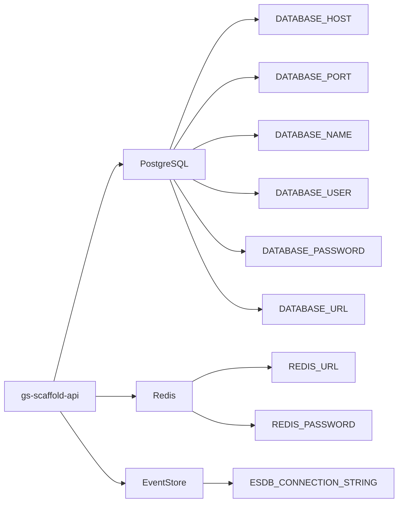
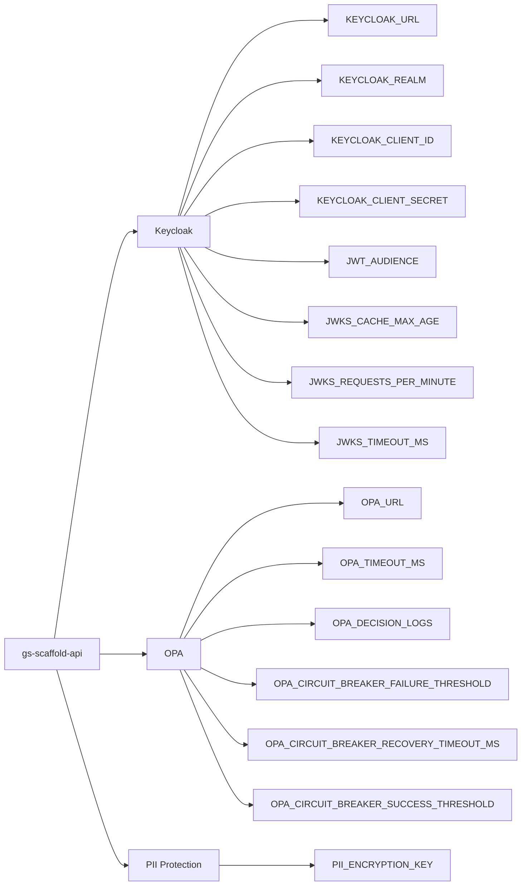
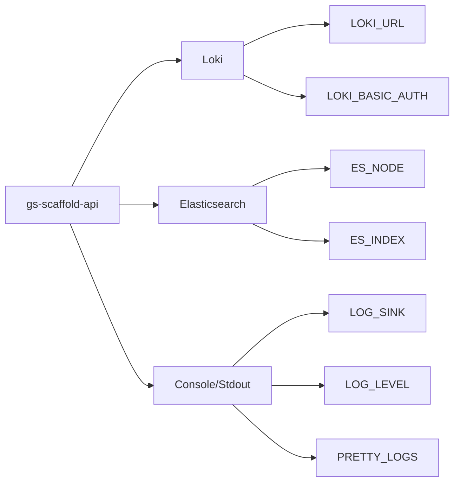

# Phase 1.3 - Current State Audit Report

> **Phase**: 1.3 Current State Audit  
> **Date**: August 15, 2025  
> **Status**: 🔍 **IN PROGRESS**  
> **Owner**: Lead Developer  
> **Duration**: 2 days

---

## 🎯 Phase Objective

Complete inventory and analysis of all existing environment variables, their usage patterns, security classification, and service dependencies to inform the Doppler migration strategy.

---

## 📋 Environment Files Inventory

### **Current .env Files Structure**

| File              | Purpose                              | Size      | Status    | Risk Level |
| ----------------- | ------------------------------------ | --------- | --------- | ---------- |
| `.env.example`    | Template for development setup       | 69 lines  | ✅ Active | Low        |
| `.env.complete`   | Complete template with all variables | 110 lines | ✅ Active | Medium     |
| `.env.security`   | Security-specific configuration      | 19 lines  | ✅ Active | **High**   |
| `.env.production` | Production logging template          | 45 lines  | ✅ Active | Medium     |

---

## 🔐 Secret Classification Matrix

### **High-Risk Secrets (Requires Immediate Attention)**

| Secret Name              | Current Usage           | Service     | Risk Level      | Rotation Needed |
| ------------------------ | ----------------------- | ----------- | --------------- | --------------- |
| `KEYCLOAK_CLIENT_SECRET` | Authentication service  | Keycloak    | 🔴 **Critical** | Yes             |
| `PII_ENCRYPTION_KEY`     | Data protection service | Application | 🔴 **Critical** | Yes             |
| `DATABASE_PASSWORD`      | Database connection     | PostgreSQL  | 🔴 **Critical** | Yes             |
| `REDIS_PASSWORD`         | Cache/session store     | Redis       | 🟡 **High**     | Yes             |
| `LOKI_BASIC_AUTH`        | Logging authentication  | Loki        | 🟡 **High**     | Optional        |

### **Medium-Risk Configuration**

| Variable Name            | Purpose                          | Default Value                     | Environment Sensitive |
| ------------------------ | -------------------------------- | --------------------------------- | --------------------- |
| `DATABASE_URL`           | Complete DB connection string    | None                              | Yes                   |
| `REDIS_URL`              | Complete Redis connection string | `redis://localhost:6379`          | Yes                   |
| `ESDB_CONNECTION_STRING` | EventStore connection            | `esdb://localhost:2113?tls=false` | Yes                   |
| `KEYCLOAK_URL`           | Auth service endpoint            | `http://localhost:8080`           | Yes                   |
| `OPA_URL`                | Policy service endpoint          | `http://localhost:8181`           | Yes                   |
| `LOKI_URL`               | Logging service endpoint         | `http://loki:3100`                | Yes                   |

### **Low-Risk Application Settings**

| Variable Name | Purpose                | Default Value | Environment Sensitive |
| ------------- | ---------------------- | ------------- | --------------------- |
| `APP_NAME`    | Application identifier | `gs-scaffold` | No                    |
| `APP_VERSION` | Application version    | `0.0.1`       | No                    |
| `NODE_ENV`    | Runtime environment    | `development` | Yes                   |
| `PORT`        | Server port            | `3000`/`3010` | Yes                   |
| `PROTOCOL`    | Server protocol        | `http`        | Yes                   |
| `HOST`        | Server binding         | `localhost`   | Yes                   |

---

## 🏗️ Service Dependency Mapping

### **Database Dependencies**



### **Security & Auth Dependencies**



### **Logging & Observability Dependencies**



---

## 📊 Configuration Usage Analysis

### **Environment Variable Sources**

| Location                                                        | Count | Purpose                       | Risk Assessment |
| --------------------------------------------------------------- | ----- | ----------------------------- | --------------- |
| `src/shared/config/app-config.util.ts`                          | 24    | Central configuration utility | Medium          |
| `src/shared/security/config/security.config.ts`                 | 12    | Security configuration        | **High**        |
| `src/shared/logging/logging.providers.ts`                       | 8     | Logging configuration         | Low             |
| `src/shared/security/opa/opa.client.ts`                         | 5     | OPA policy client             | Medium          |
| `src/shared/security/data-protection/pii-protection.service.ts` | 1     | PII encryption                | **Critical**    |
| Test files and demos                                            | 15+   | Development/testing           | Low             |

### **Environment-Specific Configuration Patterns**

#### **Development Environment**

- Uses `.env.example` as base template
- Defaults to localhost services
- Pretty logging enabled
- SSL/TLS typically disabled
- Default ports and simplified configuration

#### **Production Environment**

- Requires all high-risk secrets
- HTTPS/TLS enforced
- Structured logging (stdout)
- Performance optimizations enabled
- External service endpoints

#### **Staging Environment**

- Mix of production and development patterns
- May use direct Loki integration
- Simplified SSL requirements
- Test data configurations

---

## 🔍 Current Secret Usage Patterns

### **Hardcoded Fallbacks (Security Risk)**

```typescript
// HIGH RISK: Hardcoded encryption key fallback
return process.env.PII_ENCRYPTION_KEY || 'default-key-change-in-production';

// MEDIUM RISK: Default service URLs
const keycloakUrl = process.env.KEYCLOAK_URL || 'http://localhost:8080';
const opaUrl = config.get('OPA_URL') ?? 'http://localhost:8181';
```

### **Configuration Validation**

Current validation exists in:

- `AppConfigUtil.validateLoggingConfig()`
- `AppConfigUtil.validateSecurityConfig()`
- Basic type checking and defaults

**Missing validation:**

- Required secrets enforcement
- Format validation for connection strings
- Environment-specific requirements

---

## 🚨 High-Priority Migration Items

### **Immediate Action Required**

1. **Critical Secrets (Week 1)**
   - `KEYCLOAK_CLIENT_SECRET` - Currently has no hardcoded fallback ✅
   - `PII_ENCRYPTION_KEY` - Has dangerous hardcoded fallback ⚠️
   - `DATABASE_PASSWORD` - No fallback, good security posture ✅

2. **Connection Strings (Week 1)**
   - `DATABASE_URL` - Complete connection with embedded credentials
   - `REDIS_URL` - May contain authentication credentials
   - `ESDB_CONNECTION_STRING` - EventStore connection with credentials

3. **Service Endpoints (Week 2)**
   - `KEYCLOAK_URL` - Authentication service endpoint
   - `OPA_URL` - Policy authorization service
   - `LOKI_URL` - Logging service endpoint

### **Medium Priority (Weeks 2-3)**

1. **Application Configuration**
   - Port and host configuration
   - Protocol and public URL settings
   - Logging and observability configuration

2. **Performance and Caching**
   - JWKS cache configuration
   - Circuit breaker settings
   - Connection pool settings

---

## 🔄 Current Configuration Flow

### **Configuration Loading Order**

1. **Environment Variables** (`process.env.*`)
2. **Default Values** (hardcoded in utilities)
3. **Runtime Detection** (container, environment)

### **Configuration Sources by Environment**

#### **Development**

```
.env (local) → .env.example → hardcoded defaults
```

#### **Staging**

```
Container env vars → .env.production → hardcoded defaults
```

#### **Production**

```
K8s secrets/ConfigMaps → hardcoded defaults (minimal)
```

---

## 📝 Migration Readiness Assessment

### **✅ Ready for Migration**

- **Centralized Configuration**: `AppConfigUtil` provides single point of control
- **Environment Detection**: Robust environment and deployment context detection
- **Validation Framework**: Basic validation exists and can be enhanced
- **Logging Configuration**: Well-structured logging with multiple sink support

### **⚠️ Requires Preparation**

- **Secret Validation**: Need stronger validation for required secrets
- **Fallback Strategy**: Remove dangerous hardcoded fallbacks
- **Environment-specific Config**: Better separation of environment-specific requirements
- **Connection String Parsing**: Need utilities for secure connection string handling

### **🔴 Blocking Issues**

- **PII Encryption Key**: Hardcoded fallback poses security risk
- **Missing Secret Detection**: No runtime detection of missing critical secrets
- **No Secret Rotation**: No infrastructure for handling secret rotation
- **Development Dependencies**: Test files directly use process.env (needs update)

---

## 🎯 Next Steps (Phase 1.4)

Based on this audit, the next phase should focus on:

1. **Remove dangerous hardcoded fallbacks** ⚡ **Immediate**
2. **Implement comprehensive secret validation** 🔧 **Day 1**
3. **Create migration mapping document** 📋 **Day 1**
4. **Set up basic Doppler configuration** 🏗️ **Day 2**
5. **Test configuration loading with Doppler** 🧪 **Day 2**

---

## 📊 Summary Statistics

| Metric                          | Count | Notes                                     |
| ------------------------------- | ----- | ----------------------------------------- |
| **Total Environment Variables** | 32+   | Across all .env files                     |
| **Critical Secrets**            | 3     | Require immediate migration               |
| **High-Risk Secrets**           | 2     | Require careful handling                  |
| **Service Dependencies**        | 6     | External services requiring configuration |
| **Configuration Files**         | 4     | Current .env file variants                |
| **Code Locations**              | 8+    | Files using environment variables         |

---

**✅ Phase 1.3 Audit Complete - Ready for Phase 1.4: Basic Configuration Schema**
